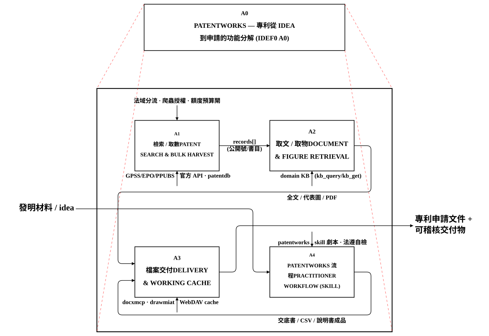
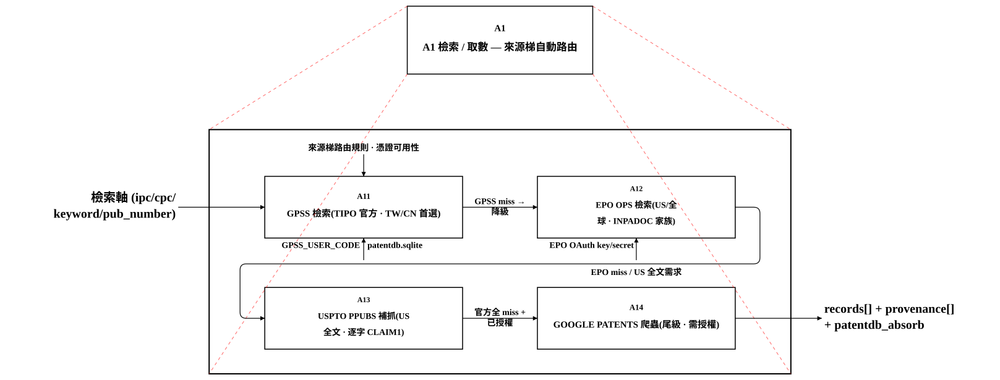
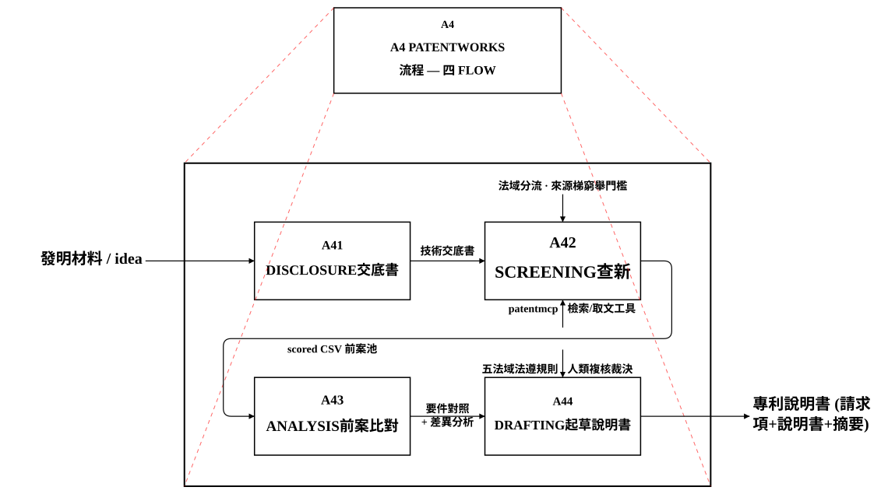
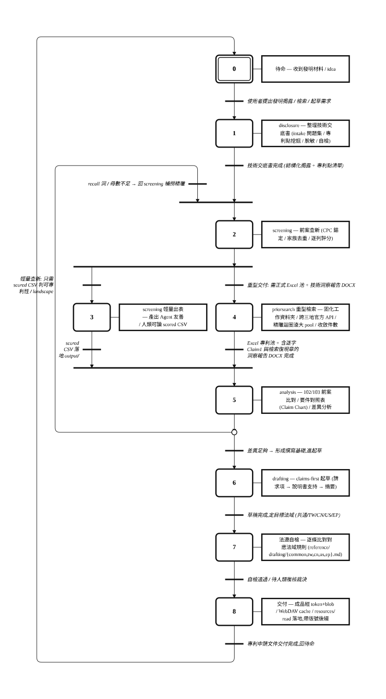

# PatentWorks

> 專利從 **idea 到申請** 的全流程工作站 —— 一個 **MCP server + skill 組合包**,把「檢索前案 → 挖專利點 → 起草說明書」這條專利從業旅程,變成 AI 可執行、人類可複核、全程可稽核的工作流。設計為與 OpenCMS、docxmcp、drawmiat 串接。

專利工作有法律份量:一件檢索漏了關鍵前案、一段請求項寫得不夠嚴謹,代價都很高。PatentWorks 的設計哲學是 **「AI 做預篩 / 起草草稿 + 解釋,人類複核裁決」**——AI 當超級執行引擎(組合覆蓋、讀取吞吐、完整記錄、可逆重做都勝過人),把判斷節點明確交還給你。

> 本專案於 2026-06 全面重定位並與其 AGPL 前身**斷開血脈**,以 MIT 重新授權。歷史、舊 8 層多 Agent 架構(A0–A8)、HLS/Grafcet 實驗等皆已廢除。

---

## 這是什麼、能做什麼

PatentWorks 由**兩塊**構成,一塊是工具(MCP server),一塊是劇本(skill):

| 組成 | 角色 | 你得到什麼 |
|---|---|---|
| **`patentmcp`**(MCP server) | 專利資料的**檢索與檔案交付引擎** | 一個 `patent_search` 入口打三地官方專利庫、取全文/claim/代表圖、把成品安全交付出來 |
| **`patentworks`**(skill) | 專利從業的**流程劇本** | disclosure→screening→analysis→drafting 四個 flow,教 AI 怎麼把工具串成一趟正確的專利工作 |

沒有 skill,工具只是一堆 API;沒有工具,skill 只是一份 SOP。兩者合起來,才是「把一個技術 idea 走到可送件的專利申請文件」的完整工作站。

### 功能總覽(IDEF0 A0)

下圖是最頂層的功能分解:左邊進來的是**發明材料 / idea**,右邊出去的是**專利申請文件 + 可稽核交付物**。四個功能群 A1–A4 各司其職,上方是控制(法域分流、爬蟲授權、法遵自檢),下方是機制(官方 API、patentdb、docxmcp/drawmiat)。

- **A1 檢索 / 取數** — 單一入口 `patent_search` 沿來源梯自動路由,命中即吸收進 patentdb。
- **A2 取文 / 取物** — 逐字 claim 1、官方代表圖、PDF,從缺前必走窮舉梯。
- **A3 檔案交付** — token+blob store、WebDAV working cache、協定原生 `resources/read`;bytes 不過 context。
- **A4 patentworks 流程** — 四 flow 可單用或串成完整旅程(下方 GRAFCET 詳解)。

---

## 功能群一:檢索 / 取數(A1)

**你不選來源。** 呼叫單一入口 `patent_search`,server 依你的憑證可用性與查詢軸,沿來源梯**自動路由**——每級嘗試都記進回傳的 `provenance[]` 供稽核。這是 PatentWorks 最核心的設計:把「該打哪個庫」的判斷從使用者身上拿掉,做成引擎內建的降級鏈。

### 來源梯(IDEF0 A1 分解)

| 級 | 來源 | 定位 | 專長 |
|---|---|---|---|
| ① | **TIPO GPSS** | TW/CN 首選 · 官方 REST | IPC 錨定、Claim1 隨頁、長 query 自動分片 |
| ② | **EPO OPS** | US / 全球 · 官方 API | INPADOC 家族、布林 CQL、大母數自動切片 |
| ③ | **USPTO PPUBS** | US 全文補抓 | 逐字 Claim1、USPC 軸、`claim1_empty` 補齊 |
| ④ | **Google Patents 爬蟲** | 尾級 · **需明確授權** | 官方全 miss 且 `allow_scraping=true` 才啟用,否則 `SCRAPING_REQUIRED` fail-fast |

- **找「最相關幾件」用 `patent_search`;要「完整書目一次全拉」用 `patent_bulk`**(coverage,非 relevance,`source` 必填顯式選源)。
- **每次命中即自動吸收進全域 patentdb** —— 檢索矩陣跑完池就已入庫,不需收尾手動回填。
- **爬蟲是被工程收斂的合規路徑**(單線 + 限速 + 需同意),不是紅線;`allow_scraping` 由使用者明確授權才啟用。

> ⛔ **成本意識**:GPSS 配額按「輸出筆數」計 + 時段制重置;實撈挑下班時段(30,000 筆額度)。批量實撈前先估「輸出筆數 vs 剩餘額度」——詳見 skill 的額度預算硬閘。

---

## 功能群二:取文 / 取物(A2)

檢索拿到的是書目;要**逐字 Claim 1、官方代表圖、全文 PDF** 得再走取文梯。核心紀律是**「窮舉門檻」**:在報告中宣告任一欄位「從缺 / 無解」之前,必須沿來源梯逐級走完,並為每一級留下實測結果。

- **逐字 Claim 1 從缺前必走 PPUBS**:US 案 `claim1_empty:true` → `ppubs_batch_get_claims` 補抓。
- **代表圖要取官方指定的那一張**:TW/CN 案**首選** `gpss_download_representative_figure`(GPSS headless,country-agnostic,直出官方乾淨代表圖、無頁首帶狀)/ 批量走 `patentmcp_batch_download_figures`;`extract_representative_figure` 的 PDF 抽 FIG.1 是**次佳來源**,只在官方代表圖實測確無時才降級。
- **某工具回空 ≠ 整件事終局無解** —— 一律換工具 / 走下一級 / 從已在手的中間產物再加工。

---

## 功能群三:檔案交付(A3)

交付物是人類可讀的成品(scored CSV、Excel 專利池、說明書 DOCX)。PatentWorks 的鐵律是 **bytes 不過 context** —— 大檔不塞進對話,用 handle 交付:

- **token+blob store**:`/files/{token}/blob/{rel}` host-private 快取。
- **WebDAV working cache**:`cache_provision`(拿 mount + 一次性憑證)→ 掛載 PUT 投料 → `cache_export`(顯式落地)→ `cache_close`(dirty gate 擋未 export)。
- **協定原生 `resources/read`(R17.1(c))**:每個產物可經 `patent://{token}/{rel}` 在 MCP 協定地板上取得,**不需** host-private 擴充;純 MCP 客戶端也能取件。
- **交付門檻**:`cache_export` 前跑 typed asset preflight —— 空工作樹 `EXPORT_EMPTY` 拒交付,transport-valid 但 empty 不得報 delivery-ready。

---

## 功能群四:patentworks 流程(A4)—— 主旅程

skill 提供四個 flow,可單用、也可串成從 idea 到申請的完整旅程。前一段的產出是後一段的輸入:

| flow | 你要做的事 | 產出 |
|---|---|---|
| **disclosure** | 整理交底書 / 從專案材料挖專利點 | 結構化技術交底書(intake 問題集、專利點挖掘、脫敏、自檢) |
| **screening** | 找前案 / 查有沒有人做過 / 技術現況 | Agent 友善、人類可讀的 **scored CSV**(分「可專利性」與「landscape」) |
| **analysis** | 前案 102/103 比對 / 做要件對照表(Claim Chart) | 差異分析 + 撰寫基礎 |
| **drafting** | 寫專利說明書 / 請求項 / 起草申請 | 請求項 + 說明書 + 摘要(共通/TW/CN/US/EP 五法域) |

> screening 內部又分「可專利性(要件對照→新穎性綜述)」與「landscape(主題分群→技術地圖)」;要正式 Excel 池 + 技術洞察報告 DOCX 走重型的 **priorsearch** flow。

### 主旅程狀態機(GRAFCET)

下圖用 IEC 60848 GRAFCET 描述完整旅程的**執行順序與分岐**。注意兩個關鍵控制點:screening 後**分岐**(輕量 CSV / 重型 priorsearch);analysis 後**可回流** screening 補撈精雕(recall 洞 / 母數不足時),形成前案池「越滾越完整」的迴圈。

領域骨幹見 `skills/patentworks/patent-practitioner-workflow.md`。

---

## 快速上手

1. **註冊 MCP**:`.mcp.json`(gitignored,含憑證路徑)註冊 patentmcp;以 `uv --directory vendor/patents-mcp run patent-mcp-server` 啟動。
2. **載入 skill**:任何不只是單發檢索的工作(起草、跑 screening/priorsearch 管線、要件對照),**第一動作就是載入 `patentworks` skill**——tool-chain idiom(選 flow、判讀來源梯、交付契約)住在 skill 裡,per-tool description 裝不下。
3. **開始**:依需求選一個 flow(見上表),**先讀對應 flow 檔再執行**。

### 檢索來源金鑰

| 來源 | 需要 | 狀態 |
|---|---|---|
| Google Patents | 免認證 | 已可用 |
| TIPO GPSS | `GPSS_USER_CODE`(向 TIPO 申請) | 官方首選 |
| EPO OPS | OAuth consumer key/secret | 每週 4 GB 免費額度,超量阻斷不扣款 |
| Google BigQuery(選用) | `GOOGLE_CLOUD_PROJECT` + `GOOGLE_APPLICATION_CREDENTIALS` | 受禁/需明示授權(計費 API) |

> **憑證絕不寫進報告 / log。** 檢索金鑰只存活於環境變數與 gitignored 的 `.mcp.json` / `.env`,不進版控。

---

## 端點

- `/mcp`(Streamable HTTP)、`/`(landing)
- `/tools`(機器可讀工具 schema,取自 live registry,錯誤直接 500 不靜默)
- `/health`(liveness;`/healthz` 為相容別名)
- `/files/{token}/blob/{rel}`(blob 取件)、`/skills/patentworks.zip`(skill 打包)
- **`resources/read` @ `patent://{token}/{rel}`**(R17.1(c) 協定原生產物地板)

生命週期:`webctl.sh {start|stop|restart|refresh|health|clean|purge}`;`scripts/patentmcp-self-heal.sh {--check|--heal}` 探測 UDS socket,不健康時只重建 `patentmcp-${USER}` compose project。

---

## 設計原則

- **輸出不變式**:任何檢索的工作面一律是 Agent 友善、人類可讀的 CSV(中間產物,落 `output/`);**最終交付物**依 `skills/patentworks/SKILL.md`「交付物落點與版本管理契約」——docx/pdf/png/xlsx/pptx 帶版號後綴(`_v<N>`)落專案根目錄,改版舊版移 `.history/`。
- **母數 ≠ 樣本**:檢索命中「計數」不是專利池;要有效樣本必須實撈 records 落地,跑完 篩雜訊 → 去重 → 重分類 三道工序(skill 鐵律 0)。
- **AI 預篩/起草 + 解釋,人類複核裁決**(專利有法律份量)。
- **大道至簡**:不重造 docxmcp / drawmiat / OpenCMS 已能服務的子系統。

## 參考材料

`refs/` 收錄三個外部專利相關專案供研讀(各自授權;見 `refs/README.md`)。**AGPL 來源(PatentWriterAgent)僅供研讀,其程式碼不得進本產品。**

## 授權

MIT,見 [LICENSE](LICENSE)。
