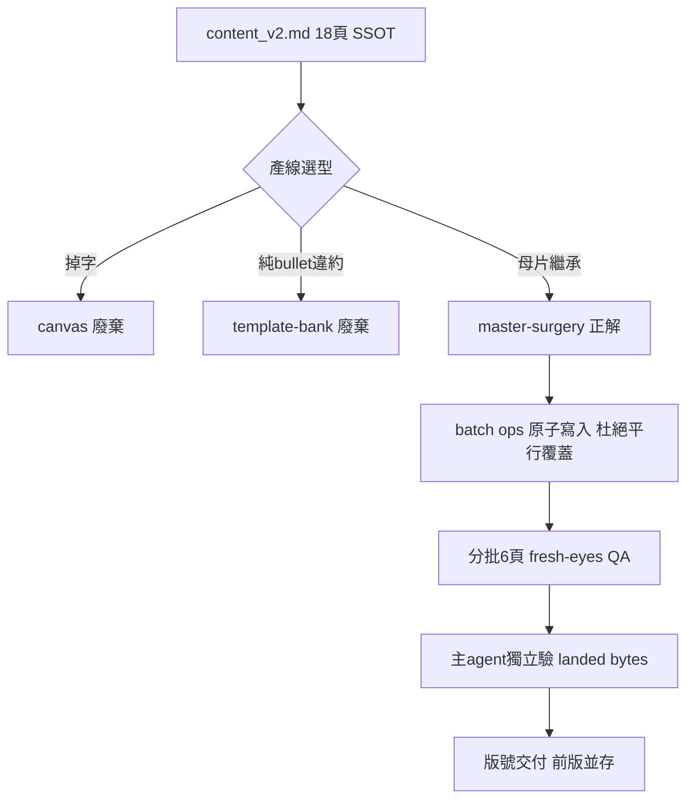

# Proposal: AI 專利協作導覽簡報（18 頁 16:9）

_語言：[zh-hant](./) · **en**_

> Auto-generated index for the `deck_ai-patent-collab-pptx` topic. Edit the source files; this README mirrors them. Do not edit this file directly.

## Status

**Verified** · 4 history entries · last advance 2026-07-18 (mode `migration` from designed)

## Source artifacts

- [`proposal.md`](./proposal.md) — why this exists · modified 2026-07-18
- [`design.md`](./design.md) — architecture & decisions · modified 2026-07-18
- [`tasks.md`](./tasks.md) — checklist · 9/9 done (100%) · modified 2026-07-18
- `.state.json` — lifecycle state machine

## Why (excerpt)

一份對外介紹「AI 協作專利全流程工作站」的 18 頁投影片，走利善美/thesmart 品牌母片（深紅 `#B01722`）。本 spec 是**追認式**沉澱——deck 已於 2026-07-18 交付（`AI專利協作導覽_r1.2.pptx`），但整個製作過程即興推進、反覆試錯燒掉大量時間，未先開 plan。此 spec 把「三條產線為何失敗、master-surgery 為何是唯一正解、平行覆蓋根因」固化成可複用知識，讓下次做同類品牌簡報不必重踩。

[Full →](./proposal.md)

## Architecture overview

[Full design →](./design.md)

## Recent activity

- 2026-07-18: `migration` designed → verified — gate-paradox administrative repair 2026-07-19: all tasks checked (2.2 distill just landed: workflow.pptx.brand-deck.master-surgery + 2 failure-modes); 3.1 [~] nice-to-have not-executed by design; planned gate requires unchecked item so natural ladder unreachable
- 2026-07-18: `promote` proposed → designed — 追認式知識沉澱：三產線失敗機制 + master-surgery DD-1/2/3 已寫入 design.md
- 2026-07-18: `sync` proposed → proposed — set lifecycle profile software → docs (drives plan-validate artifact requirements)
- 2026-07-18: `new` (initial) → proposed — initial spec created via plan-init.ts

<!-- AUTO-GENERATED by plan-builder MCP plan_sync · 2026-07-18T18:10:36Z · do not edit this file. -->
