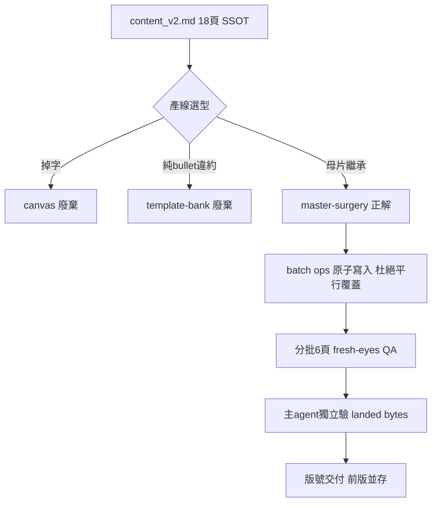

# Design: AI 專利協作導覽簡報製作方法論

## Context

品牌簡報（thesmart 母片 + blueprint「禁純 bullet」契約）的正確產線選型與施作紀律。本文件的價值不在流水帳，而在把**三條產線各自的失敗機制**講清楚，讓下次選型不用重試。deck 已交付，此為追認式知識沉澱。

## Goals / Non-Goals

**Goals**

- 固化三產線失敗機制 + master-surgery 正解，供未來同類簡報選型。
- 記錄 master-surgery 平行覆蓋根因與正解（batch ops）。

**Non-Goals**

- 不重做已交付的 deck；不改 docxmcp 工具實作（已獨立 committed）。

## Decisions

- **DD-1: master-surgery 施作紀律——杜絕平行覆蓋。** 根因（本 session 最大技術病根）：`set_shape_text` 的實作是「從 base pptx 重新 decompose → 只套自己那一筆 → 整包寫回」。用平行 tool_use 一次送 13 個 `set_shape_text`，每個 call 各拿同一 base、各自寫回，互相 clobber，最後只有一筆存活，QA 一看「多數頁沒生效」。正解：`action=batch ops[]`（單次原子變更多 shape）或嚴格循序；禁止對同一 token 平行送多個寫入 call。這是 pptx skill「一次 batch 一頁」clean-room 紀律的具體實例。
- **DD-2: 留白填充手法——垂直置中，非 fit_text。** S13-15 中段灰欄三步只佔上半、下方 40% 留白。先試 `fit_text` 親驗無效（字放大 fit 進 box，但 box 仍 top-anchor，留白沒消）。正解 = 垂直置中（`set_shape` 每 shape 一個 anchor 屬性，零幾何位移），留白對稱分佈看起來是刻意設計。
- **DD-3: QA 分批避開 media budget。** 前 session 單 subagent 塞 18 張 render 撞 inline media budget（~11 張/turn），撞牆後繞圈（試 attachment reader → task dispatch 被拒 → 猜測後 7 頁）燒 token 卻沒真看。正解：分 3 批各 6 頁並行 review subagent，各獨立 session 各算額度，實測零撞牆。此案例直接催生 SYSTEM.md §3 fail-fast 契約。

## 三條產線與各自失敗機制（核心知識）

| 產線 | 機制 | 結果 | 判定 |
|---|---|---|---|
| **canvas**（gen_canvas.py：HTML 絕對定位 → `docxmcp_pptx_render`） | render 靜默掉字 | 文字消失，違反完整性 | ❌ 廢棄 |
| **template-bank**（build_payload.py：archetype + slots） | 產出純 bullet 版式 | 違反 blueprint「禁純 bullet」硬契約 | ❌ 廢棄 |
| **master-surgery**（thesmart 母片上 `set_shape_text` / `add_shape` / grid `rect()` ops） | 母片繼承 + 逐 shape 視覺化 | 品牌色帶/logo/字型自然繼承，可放任意視覺形式 | ✅ 唯一正解 |

**選型鐵律**：要「品牌樣式」的簡報 = 母片繼承（master-surgery / template vault materialize），不是 from-zero canvas 塗品牌色。canvas 是 lossy 授權路徑（掉字/背景烤成 shape）；template-bank 對「禁純 bullet」契約無能為力。

## Risks / Trade-offs

- master-surgery 逐 shape 施作較慢 — 但用 `batch ops[]` 一頁一次原子寫入可攤平，且是唯一同時滿足「母片繼承 + 禁純 bullet」的路徑。

## Critical Files

- `output/slides_src/content_v2.md` — 18 頁內容 SSOT（S1–S18）
- `output/slides_src/layout.py` — grid 常數（`rect()`/`gap()` 生產路徑；`__main__` 自檢區塊引用不存在的舊 span 殘留，勿用）
- `output/slides_src/gen_canvas.py` — canvas 產線（掉字，廢棄）
- `output/slides_src/build_payload.py` — template-bank 產線（純 bullet，廢棄）
- 交付：`~/GoogleDrive/Projects/20260718Patents/AI專利協作導覽_r1.2.pptx`；vault template id `tpl_thesmart_template_16to9_f392a468c109`

## Architecture

