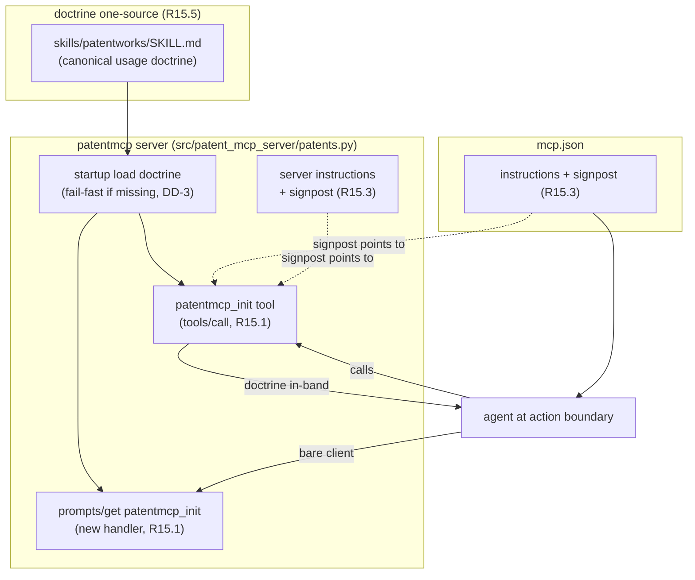

# Proposal: mcp_r15-self-describing-guide

_語言：[zh-hant](./) · **en**_

> Auto-generated index for the `mcp_r15-self-describing-guide` topic. Edit the source files; this README mirrors them. Do not edit this file directly.

## Status

**Verified** · 6 history entries · last advance 2026-07-07 (mode `promote` from implementing)

## Source artifacts

- [`proposal.md`](./proposal.md) — why this exists · modified 2026-07-07
- [`design.md`](./design.md) — architecture & decisions · modified 2026-07-07
- [`tasks.md`](./tasks.md) — checklist · 13/13 done (100%) · modified 2026-07-07
- `.state.json` — lifecycle state machine

## Why (excerpt)

- opencode 的 fleet MCP 標準 `mcp-integration-standard` 於 2026-07-07 extend 增訂
  **R15（self-describing organism / in-band usage guidance）** 為 MUST 條文。patentmcp
  是 fleet conformant service，須採納 R15，複製 docxmcp reference pattern。
- 病根（R15 要治的 L3）：patentmcp 的 usage doctrine（USPTO/Google Patents/TIPO/EPO
  多源檢索管線、flow 選用、專利工作池資料樹規範、organ coordination）目前只活在
  host-side prose —— companion skill `skills/patentworks/SKILL.md` + AGENTS.md 路由。
  模型必須主動載入且不能反射略過；經驗上會反射略過（confident-but-wrong prior 壓過
  loaded prose）。R15 把 doctrine 放上 portable MCP surface，以 tool result 形式在
  action boundary 就地遞送 —— delivered context，非 remembered context。

[Full →](./proposal.md)

## Architecture overview

[Full design →](./design.md)

## Recent activity

- 2026-07-07: `promote` implementing → verified — 全 13 task 子項 completed;live smoke over UDS 全綠(tool/prompt byte-identical、annotations、signpost、fail-fast);architecture.md 已同步 R15 sync note
- 2026-07-07: `promote` planned → implementing — 開始實作 T1-T5
- 2026-07-07: `promote` designed → planned — handoff 填實,optional scaffold 已清,進 planned
- 2026-07-07: `promote` proposed → designed — recon 完成,設計待定點全落地:FastMCP @mcp.prompt 可用、\_skills_root() 可複用定位 SKILL.md、docs profile 已設
- 2026-07-07: `sync` proposed → proposed — R15 doctrine surface 落地(guide tool + prompts handler + signpost);架構已由 design.md mermaid 表達,sequence/data-schema/idef0/grafcet 為此小型 surface 過重,demote 為 optional

<!-- AUTO-GENERATED by plan-builder MCP plan_sync · 2026-07-07T08:02:31Z · do not edit this file. -->
