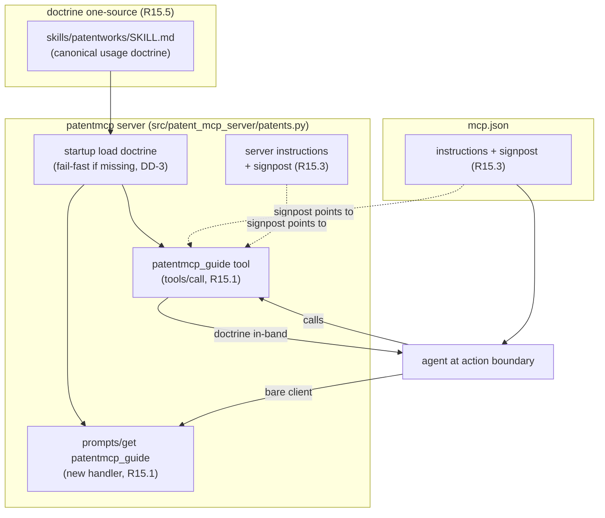

# Design: mcp_r15-self-describing-guide

## Context

patentmcp 是 fleet MCP 標準 `mcp-integration-standard` 的 conformant adopter。標準
2026-07-07 extend 增訂 R15（self-describing organism / in-band usage guidance）為
MUST。本 plan 由 docxmcp reference plan 複製而來，做 patentmcp-specific 落地。

patentmcp 現況（recon 2026-07-07）：

- `mcp.json`（`/home/pkcs12/projects/patentmcp/mcp.json`）`id: patentmcp`；有 description
  （USPTO/Google Patents BigQuery/TIPO GPSS/EPO OPS），**instructions signpost 待確認/
  新增**。
- MCP server 主檔 `src/patent_mcp_server/patents.py`（+ `_http_app.py`）；**無 prompts/get
  handler**（需新建）。
- companion skill `skills/patentworks/SKILL.md`（章節：完整管線 / 選 flow / 共用原則 /
  領域骨幹 / 專利工作池資料樹規範）= R15 要投影的 doctrine source。
- 尚無 `patentmcp_guide` tool。

因此 R15 對 patentmcp 的 delta：加 guide tool、**新建 prompts handler** 並加 R15 entry、
補 signpost、建 one-source 投影機制。

## Goals / Non-Goals

**Goals**

- `patentmcp_guide` MCP tool 回傳完整 usage doctrine（R15.1 tool 面）。
- `prompts/get patentmcp_guide` 回傳同源 doctrine（R15.1 prompts 面；需新建 handler）。
- `instructions` + server instructions 補 signpost（R15.3）。
- doctrine 單一來源投影，杜絕三份漂移（R15.5）。

**Non-Goals**

- 不改既有 tools 行為；不重寫 patentworks SKILL.md 內容。
- 不引入 host load-gate（R15.4 禁）、不注入 conversational nudge（天條 2）。

## Decisions

- **DD-1 (dual-protocol 同源投影)**：`patentmcp_guide` tool 與 `prompts/get`
  `patentmcp_guide` entry 都從**同一份 doctrine 來源**投影，byte-identical。拒絕手維護
  兩份（R15.5 要杜絕的漂移）。

- **DD-2 (doctrine 來源 = SKILL.md 為權威 source)**：**選定：直接以
  `skills/patentworks/SKILL.md` 為 source**（最小改動、天然與 companion skill 同源）。
  若含非 doctrine 章節，退而抽 doctrine 核心段——實作期依 SKILL.md 實際內容定，記錄為
  DD-2a。

- **DD-3 (讀取時機 = 啟動時載入 + 缺檔 fail fast)**：server 啟動時讀 doctrine 檔到
  記憶體常數。檔案缺失/空 → 啟動 fail fast（天條 11）。確認 `Dockerfile` COPY `skills/`。

- **DD-4 (signpost 措辭，service-authored 非 nudge)**：在 `mcp.json.instructions`
  與 server instructions 各補一句：
  `"USAGE GUIDE: this service self-ships its full usage doctrine — call patentmcp_guide (or prompts/get patentmcp_guide) for organ-coordination, cross-tool tradeoffs, pre-call disciplines, and gotchas before first use."`
  service 自己的 manifest 宣告，走既有 instructions rail，不注入對話流。

- **DD-5 (guide tool 註冊形態)**：`patentmcp_guide` 註冊為標準 MCP tool，
  `annotations: {readOnlyHint:true, destructiveHint:false, idempotentHint:true, openWorldHint:false}`，
  無 input 參數（或可選 `section` 過濾）。`patentmcp_` prefix 慣例一致。

- **DD-6 (新建 prompts handler)**：patentmcp 現無 prompts/get handler，需在 server 端
  新建 `prompts/list`+`prompts/get`（至少含 R15 guide entry）。範本：docxmcp
  `bin/mcp_server.py`。注意 patentmcp 是 FastMCP/Python，確認 prompts 註冊 API。

## Risks / Trade-offs

- **R1 — doctrine 檔過大**：mitigation：若超量，DD-2 退回抽 doctrine 核心段；guide
  承載 R15.2 四類，非整份 SKILL。
- **R2 — SKILL.md 在 container image 內缺失**：mitigation：DD-3 啟動 fail fast + 確認
  Dockerfile COPY skills/。
- **R3 — 新建 prompts handler 需符合 MCP spec**：mitigation：比照 docxmcp 實作為範本，
  確認 FastMCP 的 prompts 註冊方式（@mcp.prompt 或等價）。

## Critical Files

- `/home/pkcs12/projects/patentmcp/src/patent_mcp_server/patents.py` — 註冊 guide tool
  - prompts handler + server instructions signpost（tool 註冊入口）。
- `/home/pkcs12/projects/patentmcp/src/patent_mcp_server/_http_app.py` — HTTP 層（prompts
  若掛此）。
- `/home/pkcs12/projects/patentmcp/mcp.json` — `instructions` 補 signpost。
- `/home/pkcs12/projects/patentmcp/skills/patentworks/SKILL.md` — doctrine one-source。
- `/home/pkcs12/projects/patentmcp/Dockerfile` — 確認 skills/ COPY 進 image。
- `/home/pkcs12/projects/opencode/specs/mcp-integration-standard/standard.md` — R15
  條文 + §13 checklist（驗收對照）。

## Architecture

Flow：companion skill SKILL.md 是 doctrine 唯一權威 → server 啟動時載入 → guide tool
與 prompts entry 同源投影 → instructions signpost 指向 guide → agent 在 action
boundary 依 signpost 呼叫 guide → doctrine 以 tool result 就地遞送（delivered
context）。
