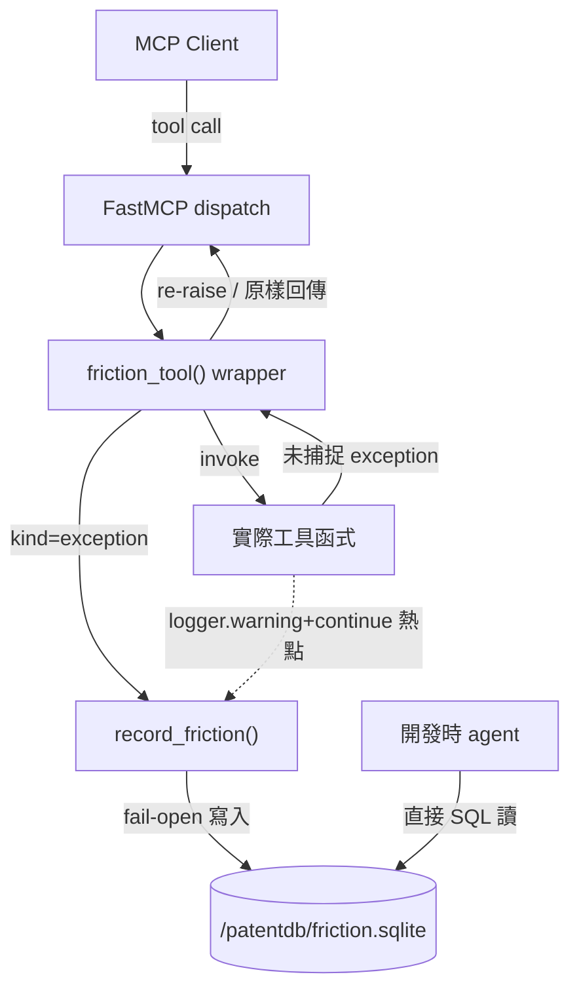

# Proposal: observability_tool-friction-log

_語言：[zh-hant](./) · **en**_

> Auto-generated index for the `observability_tool-friction-log` topic. Edit the source files; this README mirrors them. Do not edit this file directly.

## Status

**Verified** · 6 history entries · last advance 2026-07-15 (mode `promote` from implementing)

## Source artifacts

- [`proposal.md`](./proposal.md) — why this exists · modified 2026-07-15
- [`design.md`](./design.md) — architecture & decisions · modified 2026-07-15
- [`tasks.md`](./tasks.md) — checklist · 11/11 done (100%) · modified 2026-07-15
- `.state.json` — lifecycle state machine

## Why (excerpt)

- patentmcp 對外常駐服務中,但工具層的 error 與「靜默磨擦」目前無可持久、可事後查詢的觀測機制。
- 錯誤現散落三路且互不相通:(1) stderr 純文字 log(docker logs,重啟即失、無法機器解析)、(2) 回傳 envelope 的 `error_code`/`provenance`(只回呼叫端不落地)、(3) `logger.warning(...) + continue` 靜默吞掉(約 25+ 處,飄 stderr 即失)。
- 沒有一個地方能事後回答「這個 tool call 為什麼失敗」「哪個來源最常磨擦」「哪個工具最常吞錯」。

[Full →](./proposal.md)

## Architecture overview

[Full design →](./design.md)

## Recent activity

- 2026-07-15: `promote` implementing → verified — all tasks checked; container venv validation all-green
- 2026-07-15: `promote` planned → implementing — begin build
- 2026-07-15: `promote` designed → planned — tasks broken down
- 2026-07-15: `promote` proposed → designed — friction-log design fixed (docs profile: proposal+design+tasks)
- 2026-07-15: `sync` proposed → proposed — set lifecycle profile software → docs (drives plan-validate artifact requirements)

<!-- AUTO-GENERATED by plan-builder MCP plan_sync · 2026-07-15T05:41:46Z · do not edit this file. -->
