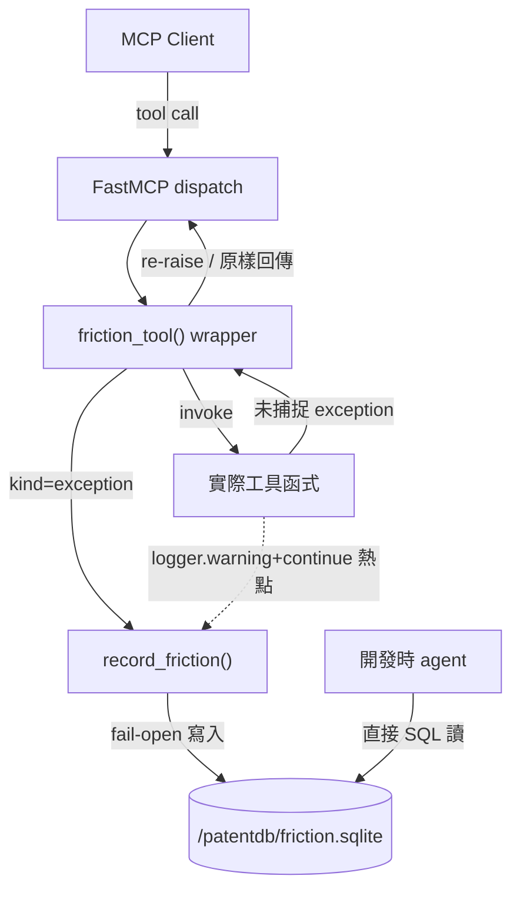

# Design: observability_tool-friction-log

## Context

patentmcp 是常駐 HTTP-over-UDS 容器,工具由 FastMCP `@mcp.tool()` decorator 原生註冊(約 45+ 工具),**無自建 dispatch handler**。目前工具層的 error 與靜默磨擦散落三路:(1) stderr 純文字 log(`patents.py:110` `logging.basicConfig` → `StreamHandler(sys.stderr)`,重啟即失)、(2) 回傳 envelope 的 `error_code`/`provenance`(只回呼叫端不落地)、(3) `logger.warning(...) + continue` 靜默吞掉(約 25+ 處)。無任何可持久、可 SQL 查詢的觀測落點。使用者需要「服務中工具遇到什麼 error 或磨擦」的可回放記錄。

## Goals / Non-Goals

**Goals**

- 一個中央 choke point 攔截**所有**工具的未捕捉 exception,結構化落地。
- 一個 helper 讓既有靜默磨擦點主動記一筆(顯式埋點)。
- 落地 SQLite,寄生 `./patentdb` bind-mount,rebuild 存活。
- 寫入 fail-open:friction store 出錯絕不影響工具主流程。
- 開發時 agent 可直接讀 sqlite 查詢(無需 MCP 工具)。

**Non-Goals**

- 不新增 MCP 查詢工具 / 儀表板 / cron 報告。
- 不記錄成功 tool call(只 error + 磨擦)。
- 不改動既有 error envelope / provenance 回傳契約。
- 不做 metrics 匯出、不改 stderr logging 現狀。

## Decisions

- **DD-1: choke point 用「wrap `mcp.tool` decorator」而非 FastMCP middleware 或逐工具埋點。** patentmcp 用 `@mcp.tool()` 逐一註冊,唯一能覆蓋全部 45+ 工具的單點是攔截 decorator 本身。做法:定義 `friction_tool()` 包在 `mcp.tool()` 外層,對被裝飾的 async/sync 函式包 try/except,捕捉未處理 exception → `record_friction(kind="exception", ...)` → 原樣 re-raise(不改變工具對呼叫端的行為)。**關鍵約束**:wrapper 必須用 `functools.wraps` 保留原函式的 `__name__`/`__doc__`/`__wrapped__` 與 signature,否則破壞 FastMCP 對參數 schema 的內省。替代方案(逐工具埋點)覆蓋不全且維護成本高,已否決;FastMCP middleware 在當前 mcp 版本非穩定公開 API,已否決。

- **DD-2: 靜默磨擦用「顯式 helper 主動埋點」,不自動偵測。** `logger.warning(...) + continue` 是語意性的(該處作者知道這是可容忍降級),無法從 exception 自動辨識。提供 `record_friction(kind="silent", tool=..., source=..., reason=..., detail=...)`,在既有熱點(absorb 失敗 `patents.py:3198`、source ladder 級 miss/error `search_dispatcher.py`、EPO throttle、SCRAPING_REQUIRED)手動加一行呼叫。首批埋點鎖定偵查已定位的高價值熱點,其餘可增量補。

- **DD-3: 儲存用 SQLite 單表,寄生 `/patentdb/friction.sqlite`。** 對齊 `PATENTS_DB_ROOT` env(`docker-compose.yml:91` = `/patentdb`)與現有 bind-mount。比照 `bigquery_client.py:153` 既有 sqlite ledger 樣板。schema 見 §data-schema。WAL 模式,單 connection lazy-init,`CREATE TABLE IF NOT EXISTS` 冪等。

- **DD-4: 寫入 fail-open。** `record_friction` 內部整段 try/except,任何 sqlite 錯誤只 `logger.warning` 後吞掉,**絕不 raise**——觀測機制不得成為服務故障源。DB 路徑不可寫時降級為 no-op。

- **DD-6: 一般化為 unified observability log(單一 store / 單一 record API / 單一查詢面)。** 使用者要求「既然要 log 就做一個 unified log mechanism」。原 friction-only 的 `friction_events` 表升級為單表 `events`,`category` 欄區分 `friction`(kind=exception|silent)與 `access`(kind=http);共用欄 + 兩類專屬欄。底層統一 `record_event()`,`record_friction()`/`record_access()` 為薄包裝(向後相容,patents.py 埋點與 wrapper 呼叫零改動)。落點改名 `/patentdb/observability.sqlite`。模組名保留 `friction_log`(既有 import 相容)。

- **DD-7: HTTP access log 用純 ASGI middleware,且必須在所有路由掛完之後才包。** HTTP 層是 uvicorn+Starlette,`_http_app.py` build_app 尾端以 `_access_log_mw` 包住已完全路由的 app,每個 HTTP 請求落一筆 W3C 語義 access row。**關鍵約束(踩過的 bug)**:middleware 不可在 `mcp.streamable_http_app()` 之後立刻包——那會把 Starlette app 換成無 `.router` 的裸 ASGI callable,導致後續 `app.router.routes.extend(...)` 掛 DAV/files 路由時 `AttributeError`。正解:只定義 middleware,延到 build_app return 前才實際包。純 ASGI(非 BaseHTTPMiddleware)故 SSE/streaming 不受影響——只 peek response-start 狀態碼,不 buffer body。實測辨識出 `mcp_client: opencode`。

- **DD-8: access log 不記 query string(W3C cs-uri-stem 語義)。** URI 只存 path(`raw_path` decode),query 剝除——對齊 DD-5 不存憑證/PII 原則(query 可能夾帶 token)。

- **DD-5: reason 正規化複用 `search_dispatcher._error_reason()` 模式。** exception → `http_error:NNN` 或截斷字串,避免存整包 traceback 撐爆表。args 只存**摘要**(工具名 + 關鍵參數的短表示),不存完整 payload(避免 PII / 憑證外洩——憑證絕不入 log,對齊 patentworks doctrine)。

## Risks / Trade-offs

- **風險:wrapper 破壞 FastMCP schema 內省** — mitigation:`functools.wraps` + 保留 `__wrapped__`;驗證階段實測 `patentmcp_init` 與任一工具的參數 schema 未變(tools/list 對照)。
- **風險:sqlite 併發寫(HTTP 多請求)** — mitigation:WAL 模式 + 每次寫入短交易 + fail-open,衝突時丟該筆不阻塞。
- **風險:埋點覆蓋不全** — trade-off:首批只鎖高價值熱點,接受增量補齊;exception 攔截層已覆蓋所有「真 error」,靜默磨擦是增量價值。
- **風險:log 表無限增長** — mitigation:本輪先不做 rotation(單表輕量);未來可加 TTL 清理,列入 observability.md。

## Architecture

## Critical Files

- `src/patent_mcp_server/patents.py` — `mcp = FastMCP(...)` (line 26)、`logging.basicConfig` (line 110)、45+ `@mcp.tool()` 註冊點、absorb 靜默磨擦熱點 (line ~3198)。攔截層注入處。
- `src/patent_mcp_server/friction_log.py` — **新增**:SQLite store + `record_friction()` + `friction_tool()` wrapper。
- `src/patent_mcp_server/search_dispatcher.py` — `_entry()` (line 145) / `_error_reason()` (line 151) 可複用 reason 正規化;source ladder miss/error 磨擦埋點處。
- `src/patent_mcp_server/google/bigquery_client.py` — sqlite ledger 樣板 (line 153) 參考。
- `docker-compose.yml` — `PATENTS_DB_ROOT=/patentdb` (line 91)、`./patentdb:/patentdb` bind-mount (line 64)。
