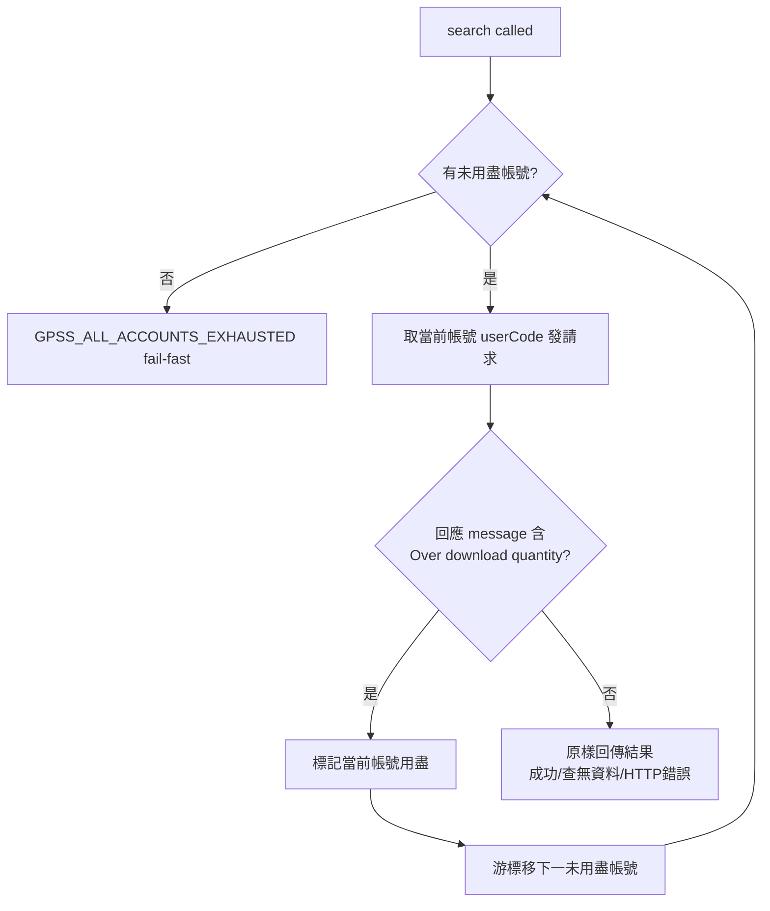

# Proposal: patentmcp_gpss-account-rotation

_語言：[zh-hant](./) · **en**_

> Auto-generated index for the `patentmcp_gpss-account-rotation` topic. Edit the source files; this README mirrors them. Do not edit this file directly.

## Status

**Verified** · 5 history entries · last advance 2026-07-17 (mode `promote` from implementing)

## Source artifacts

- [`proposal.md`](./proposal.md) — why this exists · modified 2026-07-17
- [`design.md`](./design.md) — architecture & decisions · modified 2026-07-17
- [`tasks.md`](./tasks.md) — checklist · 16/16 done (100%) · modified 2026-07-17
- [`idef0.json`](./idef0.json) + _no SVGs yet_ — formal functional decomposition
- [`grafcet.json`](./grafcet.json) + _no SVGs yet_ — formal runtime behavior
- `.state.json` — lifecycle state machine

## Why (excerpt)

- GPSS REST API 配額按**輸出筆數**計、**時段制重置**（上班 08–18 窄上限 10,000、下班+週末寬 30,000；SKILL.md §「官方實證」）。單一帳號的時段額度用盡後，`patent_search` / `patent_bulk` 的 GPSS 梯即整段失效，只能枯等時段重置。
- 目前 `GPSSClient` 只讀單一 `GPSS_USER_CODE`（`gpss/client.py:94`），無多帳號、無 rotation、無額度感知。使用者已擁有第二個 TIPO 帳號驗證碼（<account-redacted>），要把「一個帳號額度用盡就自動換下一個」做成可擴充機制，額度加倍。

[Full →](./proposal.md)

## Architecture overview

[Full design →](./design.md)

## Recent activity

- 2026-07-17: `promote` implementing → verified — 13 rotation tests + 210 既有測試全綠, 零回歸
- 2026-07-17: `promote` planned → implementing — 進實作
- 2026-07-17: `promote` designed → planned — 全 artifacts 就緒
- 2026-07-17: `promote` proposed → designed — 設計就緒
- 2026-07-17: `new` (initial) → proposed — initial spec created via plan-init.ts

<!-- AUTO-GENERATED by plan-builder MCP plan_sync · 2026-07-17T16:32:20Z · do not edit this file. -->
