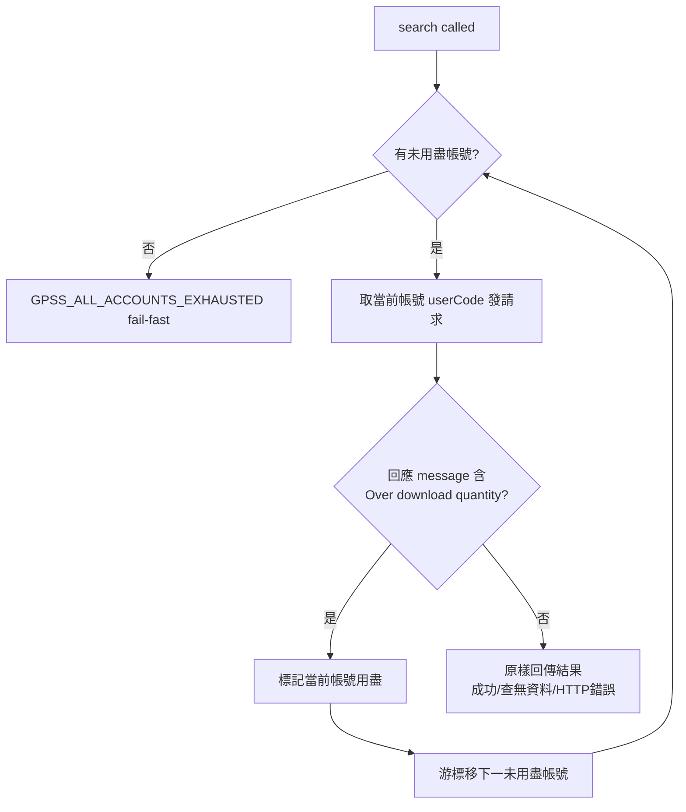

# Design: patentmcp_gpss-account-rotation

## Context

`GPSSClient`（`src/patent_mcp_server/gpss/client.py`）目前建構時只讀單一 `GPSS_USER_CODE`（line 94），`search()` 直接把該碼寫進 `userCode` query param（line 170）。整個 MCP process 共用一個 module-level 實例 `gpss_client`（`patents.py:157`），被 `patents.py` 多處與 `search_dispatcher.py`（`_run_gpss` / `bulk_export` / `bulk_harvest`）共用。

GPSS REST 配額按輸出筆數計、時段制重置；額度用盡時 GPSS 回傳 `status=success` 但 message 含 `Over download quantity`（官方時段配額用盡訊號，SKILL.md §官方實證）。單帳號用盡即整條 REST 梯失效。使用者要 N 帳號 rotation：一個用盡自動換下一個，全部用盡才停。

## Goals / Non-Goals

**Goals**

- `GPSSClient` 內建 N 帳號池 + rotation，對呼叫端完全透明（共用實例、`search()` 簽名不變）。
- 額度用盡即時換帳號重試同請求；全部用盡 fail-fast。
- `.env` 單一變數可擴充帳號數；相容舊單碼。

**Non-Goals**

- 跨 process 持久化用盡狀態（時段重置本就會恢復，process 內記憶足矣）。
- 剩餘額度精算 / 主動負載平衡（GPSS 不回剩餘額度）。

## Decisions

- **DD-1: rotation 內建於 `GPSSClient.search()`，不新增 wrapper 層。** 全 process 共用單一 `gpss_client` 實例、被十餘處呼叫；把 rotation 包在 `search()` 內是唯一對所有呼叫端零改動的位置。拒絕方案：在 dispatcher 層做 rotation（要改多個呼叫點、且 `patents.py` 直接呼叫 `gpss_client.search` 的路徑會漏掉）。

- **DD-2: 額度用盡偵測 = 回應 message 含 `Over download quantity`（大小寫不敏感）。** 這是官方時段配額用盡的確切訊號（SKILL.md:117 官方實證）。**必須與「查無資料」message 區分**：GPSS 對查無資料也回非空 message，若一律當用盡會誤觸發 rotation 燒光所有帳號。故用子字串比對 `over download quantity`，只認額度訊號。保守起見同時認 `over search quantity`（時段輸出上限的另一種表述）。拒絕方案：把所有非空 message 當用盡（會誤判查無資料）。

- **DD-3: 用盡狀態記於本次 process（`_exhausted: set[int]` 帳號索引）。** 額度用盡的帳號在本 process 內不再嘗試；重啟後清空重新開始。理由：GPSS 時段制重置，重啟時多半已跨時段或即將重置，process 級記憶足以在單次執行內避免重撞已知用盡帳號，且無需引入 state 檔與日期邊界處理（KISS）。使用者已於澄清中選定「記憶於本次 process」。

- **DD-4: 帳號池設定 `GPSS_USER_CODES`（逗號分隔）優先，相容 `GPSS_USER_CODE`（單碼）。** 解析順序：先讀 `GPSS_USER_CODES` split(',') strip 去空白去重保序；為空則退讀 `GPSS_USER_CODE` 單碼。新增帳號只需在 `GPSS_USER_CODES` 尾部加碼。拒絕方案：編號式 `GPSS_USER_CODE_1/2`（要掃描動態變數名、新增需匯入新變數名），JSON 檔（多一層檔案 IO 與讀取還輯）——使用者已選定逗號分隔單變數。

- **DD-5: 全帳號用盡 → fail-fast 結構化錯誤，不 fallback。** 回 `{success:False, error_code:"GPSS_ALL_ACCOUNTS_EXHAUSTED", error:"...", accounts_tried:N}`。不靜默回空、不偽裝查無資料（no-fallback 天條）。

- **DD-6: rotation 迴圈只針對「額度用盡」訊號換帳號。** 其他失敗（HTTP error、JSON parse 失敗、查無資料、condition length）維持原行為原樣回傳——那些與帳號額度無關，換帳號無助益，且 condition-length 有既有分片機制處理。

## Architecture

本設計掛在 IDEF0 骨架三活動上：**A1 選取當前有效帳號**（帳號池游標 + 用盡集合，對應 DD-3/DD-4）、**A2 發送 GPSS 檢索請求**（DD-1 內建於 `search()`）、**A3 判讀額度用盡訊號並輪替**（DD-2 訊號辨識 + DD-5 全用盡 fail-fast + DD-6 只對額度訊號輪替）。下方流程圖即 A1→A2→A3 的運行態展開。

## Risks / Trade-offs

- **誤判查無資料為用盡** — mitigation: DD-2 只認 `over download quantity` / `over search quantity` 子字串，不碰其他 message。以單元測試釘死「查無資料 message 不觸發 rotation」。
- **兩帳號同一時段同時用盡** — 預期行為：全部用盡即 fail-fast，符合需求「直到日額度都用盡」。使用者可挑下班時段（30k）或稍後重試。
- **rotation 期間額外請求成本** — 換帳號會重發一次請求（額度已在用盡帳號扣完）；用盡帳號本 process 不再試，故最多每帳號各撞一次用盡訊號，成本上限 = 帳號數。

## Critical Files

- `src/patent_mcp_server/gpss/client.py` — `GPSSClient.__init__` + `search()`，rotation 核心。
- `.env` / `.env.example` — `GPSS_USER_CODES` 設定。
- `src/patent_mcp_server/gpss/__init__.py` — docstring 由「單碼」更新為「帳號池」。
- `tests/test_gpss_rotation.py`（新增）— rotation 行為測試。
