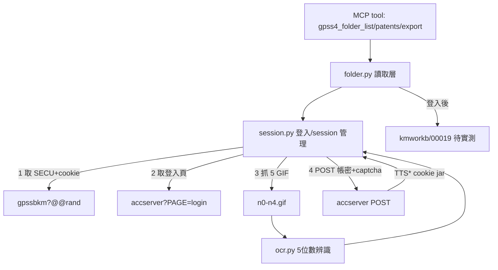

# Proposal: patentmcp_gpss4-folder-tools

_語言：[zh-hant](./) · **en**_

> Auto-generated index for the `patentmcp_gpss4-folder-tools` topic. Edit the source files; this README mirrors them. Do not edit this file directly.

## Status

**Verified** · 4 history entries · last advance 2026-07-19 (mode `promote` from implementing)

## Source artifacts

- [`proposal.md`](./proposal.md) — why this exists · modified 2026-07-11
- [`design.md`](./design.md) — architecture & decisions · modified 2026-07-11
- [`tasks.md`](./tasks.md) — checklist · 28/28 done (100%) · modified 2026-07-19
- `.state.json` — lifecycle state machine

## Why (excerpt)

TIPO GPSS4 網頁 App (`https://tiponet.tipo.gov.tw/gpss4/`) 登入後有「專案資料夾」會員功能
(patent list 收藏管理)。現有 `src/patent_mcp_server/gpss/client.py` 只走 REST 檢索 API
(單一 `userCode`),**無法**觸及此功能——專案資料夾是 **session-based 會員登入**後的頁面功能,
走自訂 `TTS*` cookie,不是 REST API userCode。

[Full →](./proposal.md)

## Architecture overview

[Full design →](./design.md)

## Recent activity

- 2026-07-19: `promote` implementing → verified — 1.6 韌性驗證完成 + 缺字 Z deferred；全套 gpss4 34 pass 零回歸；research profile（modeling artifacts optional，空 scaffold 已清）。
- 2026-07-19: `sync` implementing → implementing — 逆向工程 + 工具實作型 plan（GPSS4 登入逆向 + adv_search scraper），deliverable 是能力非 SSDLC 系統；modeling artifacts（idef0/grafcet/sequence/data-schema/…）為 optional，實質內容在 proposal/design/tasks。
- 2026-07-18: `migration` proposed → implementing — drift reconcile 2026-07-19: implementation landed long ago (46 MCP tools incl gpss4_advanced_search; e2e verified tasks 4.1/5.9); task 1.6 captcha resilience still open; modeling scaffolds unfilled tracked as debt
- 2026-07-11: `new` (initial) → proposed — initial spec created via plan-init.ts

<!-- AUTO-GENERATED by plan-builder MCP plan_sync · 2026-07-19T15:38:27Z · do not edit this file. -->
