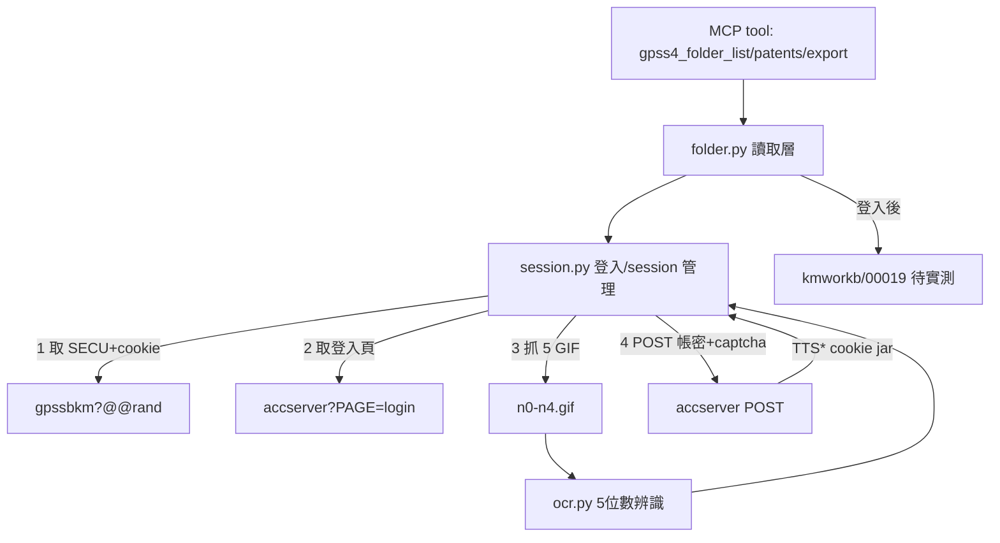

# Design: patentmcp_gpss4-folder-tools

## Context

現有 `src/patent_mcp_server/gpss/client.py` 是 GPSS **REST 檢索** client(單一 `userCode`,
無 session、無 cookie)。使用者要的「專案資料夾」是 GPSS4 **網頁 App 登入後**的會員功能,
機制完全不同:自訂 `TTS*` cookie session、5-GIF CAPTCHA、token-URL 整頁 POST。
因此新開獨立模組 `gpss4/`,不與既有 REST client 混用。

登入契約已透過逆向偵查完整掌握(見 Decisions);資料夾實際端點鎖在登入牆後,
需登入成功後實測拓出——本 design 先固化已確定的登入層,資料夾層標為「待實測」。

## Goals / Non-Goals

**Goals**

- 用 `.env` 帳密自動登入 GPSS4(OCR 過 5-GIF CAPTCHA),維護 TTS* session。
- 第一版純讀取:list folders / list patents / export。
- session 快過期(90 分)或失效自動重登。

**Non-Goals**

- 資料夾 CRUD 寫入 / 加案移除 / 標記清單操作。
- 瀏覽器自動化(純 httpx + OCR)。

## Decisions

### DD-1: 獨立 `gpss4/` 模組,不擴充既有 REST client

REST client 無狀態、無 cookie;gpss4 web 是 session-based。混用會污染連線池與語義。
新開 `src/patent_mcp_server/gpss4/{session.py, folder.py, ocr.py}`。

### DD-2: 登入契約(逆向確認 · SSOT)

- **入口鏈**:`/gpss4/` (JS 殼) → `/gpss4/gpsskmc/gpssbkm` → `gpssbkm?@@<rand>` (17KB App 首頁,發 TTS* cookie + 頁內 `SECU`)。
- **登入頁**:`GET /gpss4/gpsskmc/accserver?ID=19&SECU=<secu>&PAGE=login&RETURN=<path>`。
- **提交**:`POST /gpss4/gpsskmc/accserver`(form,整頁提交,非 AJAX)。欄位:
  - `email` (帳號)
  - `sys/00/passwd` (密碼 · 欄位名含斜線,form-encode 注意)
  - `sys/00/rand` (CAPTCHA · 5 位數)
  - hidden:`ID=19`、`SECU=<當次10位數>`、`TPHC=2`
  - 送出鈕 name:`_BTN_登入/Login^^^Si`(帶中文與動作碼,原樣送)

### DD-3: CAPTCHA = 5 張獨立單字 GIF · OCR

- `/gpss4/accserverusr/00019/n0.gif?<rand>` ... `n4.gif`。每張一位數。
- 與 session 綁定:抓圖與提交必須**同一 cookie jar**(答案存 server session)。
- OCR:每張只有一個字元,辨識難度低。用 pytesseract(`--psm 10` 單字元模式)或輕量數字分類。
  失敗重試:重抓登入頁(刷新 SECU + 新 CAPTCHA)重試,設上限(如 5 次)。

### DD-4: session 機制 · 自動重登

- cookie 組:`TTSUID`/`TTSGRP`/`TTSTRUST`/`TTSSTATUS`/`TTSSECU`/`TTSSECU_gpssbkm_19`(全 `Secure;SameSite=Strict`)。
- **登入成功判定**:登入後 `TTSUID`/`TTSGRP`/`TTSTRUST` 由空被填值(待實測確認確切訊號)。
- 存活 5400 秒(90 分)。快過期或請求被導回登入頁 → 自動重登(既定行為,經使用者批准,非新增 fallback)。

### DD-5: 資料夾端點 · 待登入實測(不臆造)

已知線索:工作簿根 `kmworkb/<ID補零>`(如 `kmworkb/00019`)、標記清單走 `gpssbkm?.<token>`、
輪詢 `ttsserv_watch`(JSON)。實際 list/patents/export 的 path/method/參數 **登入後實測拓出**,
不得臆造。實測後回填本節為 SSOT。

### DD-6: 憑證安全

`GPSS4_USERNAME`/`GPSS4_PASSWORD` 只從 env 讀,只存活於進程記憶體;
不寫進 scratch / log;CAPTCHA GIF scratch 落 `$XDG_RUNTIME_DIR`(0700)、用完即棄。

### DD-7: SCOPE PIVOT — 專案資料夾路 CLOSED,改進階檢索 scraping

專案資料夾 export 只有 bibliographic 欄位、**無 family**(INPADOC 家族編號)→ dedup 不可信 → CLOSED
(端點已完整逆向:gpssproj / clickselect / PJCMDEXP / exp_fld 等,但棄用)。改驅動登入態
**進階檢索**抓帶 family 的結果列表 → CSV,繞過 GPSS API 每日下載配額。

### DD-8: 必須 playwright 真實瀏覽器(推翻原 Non-Goal)

**根因**:GPSS4 每個頁面 URL 都帶短命 slot key(如 `gpsskm?.<hex>`),非額外 param。
httpx 手拼 `ttsserv_watch` 輪詢的 slot 必敗(手猜遞增數字對不上);瀏覽器自動
傳遞 slot key 才成。SSO landing URL 是一次性(session.py login 已消耗,再 goto 落
`timeout.html`)——正解=注入 login cookie jar 後直接 goto member.html 裡的**進階檢索
tab anchor**(帶 slot key),不重走 landing。注意:進階檢索 tab anchor ≠ 右側「進階
檢索設定」區塊的 href(後者落 `_20_*` 環境設定頁,無 `_3_10_X`)。

### DD-9: 進階檢索 query 送出契約 + 非同步 job

- **語法**(官方欄位代碼表 SSOT):標題 `(詞)@TI`、摘要 `(詞)@AB`、專利範圍 `(詞)@CL`、
  分類 `CS=G06F-0003/00`、日期 `AD=2006:2007`。自由框不加欄位=檢詳細說明+專利範圍。
  (變 `TI=(詞)` 是錯的,回 0 筆。)
- **送出**:`<form name=KM>` POST 到 `gpsskm?@@<n>`,帶 `_3_10_X`(檢索式)+ `INFO`
  (slot 憑證,從 adv 頁 harvest)+ image submit `_IMG_檢索.x/.y`。
- **非同步 job**:POST 回應仍是檢索頁(帶輪詢 script)→ 輪詢
  `ttsserv_watch?kmwork/km.swp:<num>:<slot>:全部:` 至回應含 `<!--DB_OK-->` → 結果簡目頁。
- **逆時假陽性(重要)**:頁面內嵌 `display:none` 的「您已逆時」div 是每頁常駐,
  不代表真逆時;真訊號=正向 authmarker(登出/專案/資料夾)。

### DD-10: family 坐實 — 成敗關鍵(含一個已修正的假設)

結果簡目頁預設欄位:序號/主要圖式/申請日/專利名稱/摘要(有摘要無 claims)。
**家族計數坐實**:`共 24 筆;專利家族數量 12` → 24 筆歸 12 家族,dedup 可行。

**家族綁定的正確取得路徑(修正前一版錯誤)**:
- ⏹ ~~`clickselect(this,db,rec,group)` 的 group=家族鍵~~ — **實證為誤**。2026-07-11
  驗證:18 個 clickselect 的 group 值是 1..18 逐筆遞增序號、無共享。若是家族鍵,
  24筆歸 12 家族時應有重複值。**結論:group = 結果列表逐筆選取序號
  (checkbox 用),與家族無關。**
- ✅ 家族綁定只能靠 `<tr name="famgpN">` 群組結構。點「家族收合」鈕
  (`<input type=submit value="家族收合">`)後,群組成員靠 `web_familyjob(who,job,seq)`
  **AJAX 動態載入**——scraper 需展開 `famgp<N>` 群組才能取「哪筆屬哪家族」。
- GPSS 只給「簡易專利家族」分組,**無 INPADOC 標準編號字串**;家族識別=
  分組結構(famgp群組 + 展開後成員專利號),非單一 family-ID 欄位。
- claims 需進詳目頁(簡目無)。

### DD-11: 分頁契約

- **每頁預設 50 筆**(10/20/30/40/50 可選,select selected=50)。
- **總筆數解析**:`共 <span class="numfmt">N</span> 筆,第 X/Y`(regex `共.*?numfmt[^>]*>(\d+)<.*?筆`)。
- **翻頁**:非 `PAGE=n` query。頁碼下拉 `<option value="/gpss4/gpsskmc/gpsskm?.<hex-slot>">`
  每頁一個預算好的 slot-key URL → 直接 GET(瀏覽器帶 cookie+slot)。或 `JPAGE`
  輸入頁碼 + 「顯示結果」提交。
- **短命限制**:翻頁 slot URL 是當次 render 生成的短命 token——必須從**當前頁**
  select options 即時抽,不能跨 session 重用/自己拼。scraper 需逐頁 render→抽下頁 URL→GET。
- 多頁翻頁行為(是否觸新 job / 再輪詢)未實測——scraper 實作時用寬 query 坐實。

### DD-12: 家族去重 — 非破壞性標記代表筆(最早申請日)

使用者選定語意:**非破壞性**。`annotate_family_representatives(patents)` 純函式
(in-place 標記,回傳 distinct 家族數):

- 保留每一筆,每筆加 `is_family_representative` = True/False。去重 = filter 該 flag。
- **代表挑選**:同家族內申請日**最早**者(`_apply_date_key` 將 `YYYY/MM/DD`|`YYYY-MM-DD`
  歸一化為 `YYYYMMDD`;無日期用 sentinel `99999999` 排最後,不會贏過有日期的同族)。
  tie 用 `pat_no` 破(穩定序)。
- `family_group=None` 的筆視為自身單筆家族(代表前置 True)。
- **跨頁 group 全域唯一已驗**:GPSS 家族號是整份結果連續編號(非 per-page 重置),
  實測 2 頁無擞號;distinct family groups == 代表數。注:`family_count`(收合後實際
  distinct)與 `summary_family_count`(頁面收合前估計值)可不同,以前者為準。
- **實測**:known-good query 24 筆 → 15 distinct 家族 → 15 代表;4 個多筆家族
  (1/4/5/11)代表皆為家族內最早申請日。CSV/tool 回傳新增 `is_family_representative`。

## Architecture



### DD-13 (2026-07-11): de-browsered — 進階檢索 scraper 改純 httpx，拿掉 playwright/chromium

早期 DD-8 假設「GPSS4 每頁 URL 帶短命 slot key，只有真瀏覽器能自動傳遞，httpx
手拼必敗」——**手拼部分正確，但結論錯了**。PoC 實測證明：httpx 可以從
每頁 HTML **抽出** slot key 帶到下一個請求（就像瀏覽器做的）。於是整條進階
檢索流程是純 HTTP 狀態機，瀏覽器從執行路徑完全移除。

- **login** 已是純 httpx（session.py）；**進階檢索 tab** 從 member.html（_refresh_chain）抽 slot URL。
- **query POST**：`_3_10_X`=<query> + INFO + `_IMG_檢索.x/.y`（image submit）。
- **非同步 job**：回應帶 `NeedCheck=1` + `ptmp=kmwork/N` → 輪詢
  `ttsserv_watch?<kmtmp>/km.swp:4:1:全部:` 直到 `DB_OK`（<50 筆直接回結果，不輪詢）。
- **家族收合**：POST `BUTTON=家族收合`（plain submit，非 ajax）→ 收合頁 `N.M` 序號。
- **翻頁**：簡目=頁碼 select slot URL（GET）；家族收合=JPAGE 跳頁（POST `BUTTON=顯示結果`+`JPAGE=N`）。

**關鍵 parse 修正**：GPSS 原始 HTML 的 `<tr>`/`<td>` **不閉合**（35 `<tr>` 開 vs 16 `</tr>`
閉）。playwright `page.content()` 回瀏覽器正規化後 DOM（自動補閉合）所以沒事；純
 httpx 拿原始 HTML，`re.findall(<tr>...</tr>)` 貪婪吞併把整表嗦成一塊（一列塞 18
 筆）。改用**以 `<tr` 開標籤切割**（`re.split(r'(?=<tr[\s>])')`），對不閉合 HTML 穩健。

**實測**（known-good 24 筆 query）：`total=24 family_count=15 reps=15 pages=2/2 patents=24`，
與 playwright 版**結果完全一致**，但不需 chromium。容器只需重啟（bind mount 熱掛），
無需 rebuild image / 裝 300MB 瀏覽器。

### DD-14 (2026-07-11): CLI 入口（「蒸餧成 CLI 可執行狀態」）

`adv_search.py` 加 `if __name__ == "__main__"` + argparse：

```
python -m patent_mcp_server.gpss4.adv_search "<GPSS query>" --csv pool.csv \
    [--max-pages N] [--no-family] [--dump-dir DIR]
# 首字 @ 且為檔名 → 從檔案讀 query（避開長 query 的 shell 轉義）
```

standalone 執行自動載 repo root 的 `.env`（adv_search.py 在 src/patent_mcp_server/gpss4/，
repo root 是上 3 層）。輸出一行 summary + UTF-8-BOM CSV（`seq,pat_no,apply_date,
title,abstract,family_group,is_family_representative`）。無 `--csv` 則印 JSON。

### Deployment note: 容器懑證傳遞

容器用 `uv run` 入口（依賴在 uv venv，非系統 python；`docker exec python` 會誤判
缺依賴）。GPSS4 會員懑證（`GPSS4_USERNAME`/`GPSS4_PASSWORD`，**有別於** REST API 的
`GPSS_USER_CODE`）需：(1) docker-compose.yml `environment` 列出（已補）(2) `.env` 填值
（使用者負責）。兩者之一缺位，login 便 fail-fast 回 `GPSS4_USERNAME / GPSS4_PASSWORD not set`。

## Risks / Trade-offs

- **OCR 辨識率**:CAPTCHA 若非純數字或有干擾線,辨識率下降 — mitigation: 單字元 psm + 重試上限 + 每張獨立辨識降低耦合。
- **資料夾端點未定**:token-URL 整頁模式可能無乾淨 JSON — mitigation: 登入後實測,必要時解析 HTML 表格。
- **SECU 時效/綁 IP**:每次載入首頁拿新 SECU — mitigation: 登入序列一氣呵成用當次 SECU。
- **帳密外洩**:mitigation: DD-6 憑證只在 env + 進程。

## Critical Files

- `src/patent_mcp_server/gpss4/session.py` — 登入序列 + OCR 呼叫 + TTS* cookie jar + 自動重登。
- `src/patent_mcp_server/gpss4/ocr.py` — 5-GIF CAPTCHA 數字辨識。
- `src/patent_mcp_server/gpss4/folder.py` — 資料夾 list/patents/export 讀取(端點登入後實測)。
- `src/patent_mcp_server/patents.py` (或 server 註冊點) — `gpss4_folder_*` MCP tool 註冊。
- `.env.example` — GPSS4_USERNAME/PASSWORD(已補)。
