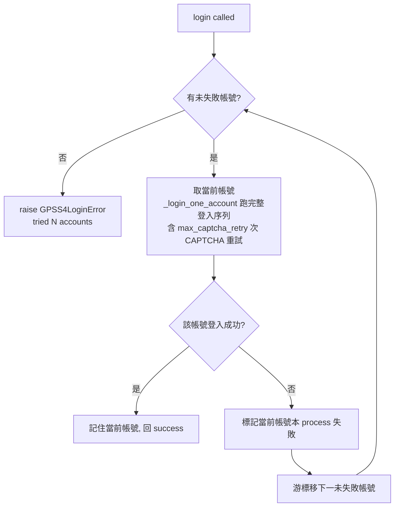

# Design: patentmcp_gpss4-login-account-rotation

## Context

`GPSS4Session`（`src/patent_mcp_server/gpss4/session.py`）目前建構時只讀單一 `GPSS4_USERNAME`/`GPSS4_PASSWORD`（line 79-80）。`login()`（line 200）跑完整登入序列（home→login page→CAPTCHA→POST→SSO refresh），內建 `max_captcha_retry`（預設 6）次 CAPTCHA 重試；重試耗盡或帳密被拒時 `raise GPSS4LoginError`。`ensure_logged_in()` / `get()` 在 session 過期時自動 re-login。

這與剛完成的 `patentmcp/gpss-account-rotation`（REST userCode rotation）**同構**：都是「多帳號憑證來源 + 主帳號不可用時自動換下一個」。差異在**觸發條件**——REST 是「額度用盡」訊號（`over download quantity`），登入模式是「登入失敗」（CAPTCHA 重試耗盡 / 帳密被拒），因會員 session 不燒 API quota、無額度語義。

## Goals / Non-Goals

**Goals**

- `GPSS4Session` 支援 N 組 (username, password) 登入帳號池，主帳號登入失敗時自動 rotate 到下一組重試。
- 全部帳號登入失敗才 fail-fast（`GPSS4LoginError`，列出已試帳號數）。
- `.env` 可擴充帳號數；完全相容舊 `GPSS4_USERNAME`/`GPSS4_PASSWORD` 單帳號。
- 對呼叫端透明：`login()` / `ensure_logged_in()` / `get()` 簽名不變。

**Non-Goals**

- 額度語義（登入不燒 API quota，無「額度用盡」概念）。
- 跨 process 持久化失敗帳號（process 內記憶即可；重啟重試主帳號合理，因失敗多為暫時性 CAPTCHA/網路）。
- 負載平衡 / 並存多 session（依序 fallback 式，非分攤）。

## Decisions

- **DD-1: rotation 內建於 `GPSS4Session.login()`，不新增 wrapper。** 同 REST rotation DD-1：`login()` 是所有登入路徑（含 `ensure_logged_in` 自動 re-login）的唯一收斂點，把 rotation 包在此處對 `get()` / folder / adv_search 呼叫端零改動。

- **DD-2: 觸發條件 = 單帳號登入失敗（`max_captcha_retry` 次嘗試皆未通過認證）。** 把現有的「單帳號 CAPTCHA 重試迴圈」抽成 `_login_one_account()`，回成功/失敗；外層 rotation 迴圈在某帳號 `_login_one_account()` 失敗後換下一帳號。與額度用盡不同：登入失敗涵蓋 CAPTCHA 無法辨識、帳密被拒、HTTP 錯誤——任一使該帳號本輪不可登入即換。

- **DD-3: 成對憑證用編號式 env（`GPSS4_USERNAME[_N]` / `GPSS4_PASSWORD[_N]`）。** 登入憑證是 username+password **成對**，不適合 REST 那種單一逗號分隔變數（會混淆哪個 user 配哪個 pass）。解析：帳號1 = `GPSS4_USERNAME`/`GPSS4_PASSWORD`（無後綴，向後相容）；帳號2+ = `GPSS4_USERNAME_2`/`GPSS4_PASSWORD_2`、`_3`… 連續掃描至缺號止。成對完整（user 與 pass 都非空）才納入池。拒絕方案：單變數逗號分隔（成對憑證含特殊字元易解析錯、user↔pass 配對不清）、JSON 檔（多一層 IO）。

- **DD-4: 失敗帳號記本次 process（`_failed_accounts: set[int]`）。** 登入失敗的帳號本 process 內 rotate 時跳過；重啟清空。理由：登入失敗多為暫時性（CAPTCHA OCR 抖動、網路），重啟重試主帳號合理；不引入 state 檔（KISS，同 REST DD-3）。注意 session 過期 re-login 不算「登入失敗」——那是正常 re-login，仍優先用當前有效帳號。

- **DD-5: 全帳號登入失敗 → `raise GPSS4LoginError`（列出帳號數 + 各帳號最後錯誤）。** 沿用既有 exception 型別（呼叫端已 catch），訊息含 `tried N account(s)`。不 fallback、不偽裝成功（no-fallback 天條）。

- **DD-6: 只對登入失敗換帳號。** 登入成功後的 session 操作（`get()` 內容抓取）失敗不換帳號——那是 session/內容問題，換帳號無助益；session 過期則走既有 re-login（用當前帳號）。

## Architecture

本設計掛在 IDEF0 骨架三活動上：**A1 選取當前有效登入帳號**（帳號池游標 + 失敗集合，對應 DD-3/DD-4）、**A2 執行單帳號登入序列**（DD-2 抽出的 `_login_one_account`，內含既有 CAPTCHA 重試）、**A3 判讀登入結果並輪替**（DD-2 觸發 + DD-5 全失敗 fail-fast + DD-6 只對登入失敗輪替）。下方流程圖即 A1→A2→A3 的運行態展開。

## Risks / Trade-offs

- **暫時性失敗浪費多帳號嘗試** — 某帳號因網路暫時失敗被標記，本 process 不再試。mitigation: 失敗判定基於 `max_captcha_retry`（預設 6）次重試後仍失敗，已對 CAPTCHA 抖動有容忍；跨 session 呼叫仍可透過重啟重試。
- **帳密真的錯 vs CAPTCHA 抖動難分** — 兩者都表現為 `_login_one_account` 失敗。mitigation: rotation 是正確反應（帳密錯的帳號本就該跳過），且 log 記錄各帳號 `驗證碼錯誤` 旗標供人判斷。
- **env 編號式掃描邊界** — 缺號即停（`_2` 存在但 `_3` 缺 → 池 = [1,2]）。mitigation: 連續掃描規則明確、測試釘死。

## Critical Files

- `src/patent_mcp_server/gpss4/session.py` — `GPSS4Session.__init__` + `login()`，rotation 核心。
- `.env` / `.env.example` — `GPSS4_USERNAME_2`/`GPSS4_PASSWORD_2` 第二帳號。
- `docker-compose.yml` — 注入 `GPSS4_USERNAME_2`/`GPSS4_PASSWORD_2`。
- `src/patent_mcp_server/gpss4/__init__.py` — docstring 單帳號 → 帳號池。
- `tests/test_gpss4_login_rotation.py`（新增）— rotation 行為測試。
