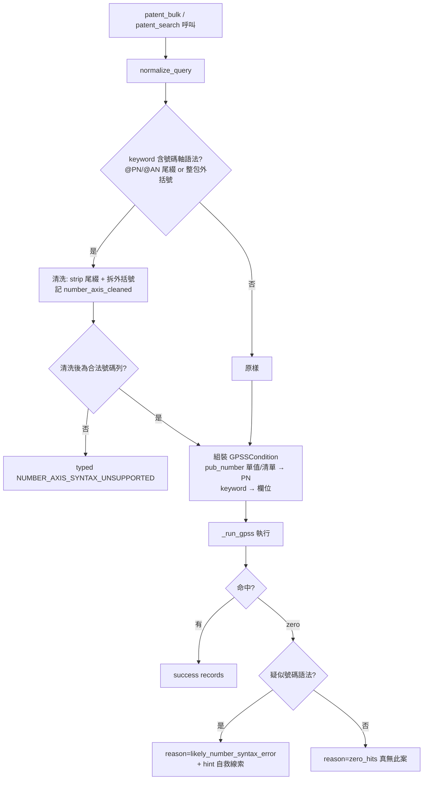

# Design: patentmcp_patent-bulk-number-axis-fail-loud

## Context

`patent_bulk`（`src/patent_mcp_server/patents.py:3722`）是統一批量檢索入口。它的 `keyword` 直接餵進 `_sd.normalize_query` → GPSS keyword 引擎。GPSS keyword 軸**不吃** web 進階檢索的號碼軸語法（`@PN` 尾綴、整包外括號）：把 `(CN117338286 or CN117338290 or ...)@PN` 當普通全文字串送出 → 命中零 → 回 `success:true, records:[], provenance.reason=zero_hits`。呼叫者看到就像「API 不支援 number query」，實際上正確寫法 `keyword="CN117338286 or CN117338290" + keyword_field="PN"`（不加 `@PN` 尾綴/外括號）完美命中。

兩個缺陷（BR_20260718）：
1. **入口不顯化（軸A 可用性）**：`patent_bulk` 沒有一等號碼清單參數；number query 只能靠 `keyword+keyword_field="PN"` 隱式達成，docstring 沒明講怎麼餵一份公開號清單。`patent_search` 已有單值 `pub_number`（patents.py:2713/3588），但 `patent_bulk` 完全沒有。
2. **靜默 zero_hits（違反 fail-loud）**：對 `@PN` 尾綴/外括號號碼軸語法無偵測、無拒絕、無清洗 → 當全文送 → zero → 回 `success:true` 而非 typed 錯。同族 `BR_20260709`（closed）已確立「GPSS 不認的欄位/語法會靜默 miss」教訓，此為同構契約破裂。

## Goals / Non-Goals

**Goals**

- `patent_bulk` + `patent_search` 提供一等 `pub_number` 清單能力（顯化 number-list 匯出入口），呼叫者不必知道 keyword 軸隱式用法。
- 偵測 keyword 內號碼軸語法（`@PN`/`@AN` 尾綴、整包外括號）→ 自動清洗成 GPSS 可接受形式，或回 typed 錯，**絕不靜默 zero_hits**。
- number/PN 軸 zero_hits 時，若 keyword 疑似號碼語法，provenance 標 `likely_number_syntax_error` 給自救線索。

**Non-Goals**

- 不破壞 `patent_search` 既有單值 `pub_number` 契約（清單化須向後相容）。
- 不動 EPO/PPUBS 來源梯的 number 處理（本 BR 症狀限 GPSS keyword 軸）。
- 不改 GPSS `PN` 條件的底層組裝語義（`GPSSCondition("PN", ...)` 已正確）。

## Decisions

- **DD-1: `pub_number` 升級為「單值或清單皆收」，不新增獨立參數。** `patent_search` 已有 `pub_number: Optional[str]`。改型別為 `Optional[Union[str, List[str]]]`：str 維持原行為（向後相容）；list 內部組成 `no or no or ...` 餵給 `GPSSCondition("PN", ...)`。`patent_bulk` 新增同款 `pub_number` 參數。拒絕方案：新增 `pub_numbers`（複數）另一參數——會與既有 `pub_number` 並存造成入口分裂、呼叫者更難選。

- **DD-2: 號碼軸語法偵測 + 清洗在 `normalize_query` 統一做（單一收斂點）。** 兩個工具都經 `normalize_query`，在此偵測 keyword 含 `@PN`/`@AN`/`@PD` 尾綴或整包外括號的號碼軸語法。**預設清洗**（strip 尾綴、拆外括號還原成 `no or no`）並在 provenance 記 `number_axis_cleaned`；清洗後仍非合法號碼列則回 typed `NUMBER_AXIS_SYNTAX_UNSUPPORTED`。拒絕方案：只在 `patent_bulk` 做——`patent_search` 同樣受影響，收斂點下沉才不遺漏。

- **DD-3: fail-loud 分級——疑似號碼語法的 zero_hits 改 typed reason。** `_run_gpss` 回 zero_hits 時，若 spec 帶清洗旗標或 keyword 疑似號碼語法，provenance.reason 由籠統 `zero_hits` 升為 `likely_number_syntax_error`，並帶 hint「keyword 軸不吃 @PN 尾綴，請用 pub_number 參數或純 no or no」。不改 `success` 語義（真 zero 仍是合法結果），只讓 reason 可辨識。

- **DD-4: 清洗優先於拒絕（可用性 > 純潔性）。** 使用者誤帶 `@PN` 是最常見情形；預設 strip 尾綴 + 拆括號讓查詢**能跑**（記 provenance 告知已清洗），比直接 fail 更符合可用性目標。只有清洗後仍無法解析成號碼列才 fail-loud。

## Architecture

掛在 IDEF0 三活動：**A1 正規化查詢並偵測號碼軸語法**（`normalize_query` + 新增號碼軸偵測/清洗，DD-2/DD-4）、**A2 組裝 GPSS 條件**（`pub_number` 單值/清單 → `GPSSCondition("PN")`，keyword → 對應欄位，DD-1）、**A3 執行檢索並分級結果**（`_run_gpss` 回 records 或 zero_hits 分級，DD-3）。

## Risks / Trade-offs

- **號碼軸語法偵測誤判**（把合法全文查詢誤當號碼語法清洗）— mitigation: 偵測條件收窄（僅 `@PN`/`@AN`/`@PD` 明確尾綴 + 整包外括號同時出現，或 keyword 全為號碼樣式 token），對一般全文 keyword 無誤傷；清洗一律記 provenance 可追溯。
- **`pub_number` 型別放寬的向後相容** — mitigation: str 分支行為完全不變，list 才走新路徑；測試釘死單值路徑不回歸。
- **清洗改變使用者原意** — mitigation: 只 strip 已知非法的號碼軸修飾（`@PN` 尾綴/外括號），保留號碼本體與 `or` 邏輯；provenance `number_axis_cleaned` 透明告知。

## Critical Files

- `src/patent_mcp_server/patents.py` — `patent_bulk`（3722，加 `pub_number` 參數 + docstring）、`patent_search`（3580，`pub_number` 清單化）。
- `src/patent_mcp_server/search_dispatcher.py` — `normalize_query`（100，號碼軸偵測/清洗）、`QuerySpec.pub_number`（88，型別放寬）、`_run_gpss` PN 組裝（183）+ zero_hits 分級。
- `tests/test_patent_bulk.py` / 新增 `tests/test_number_axis_failloud.py` — 清洗/分級/清單化測試。
