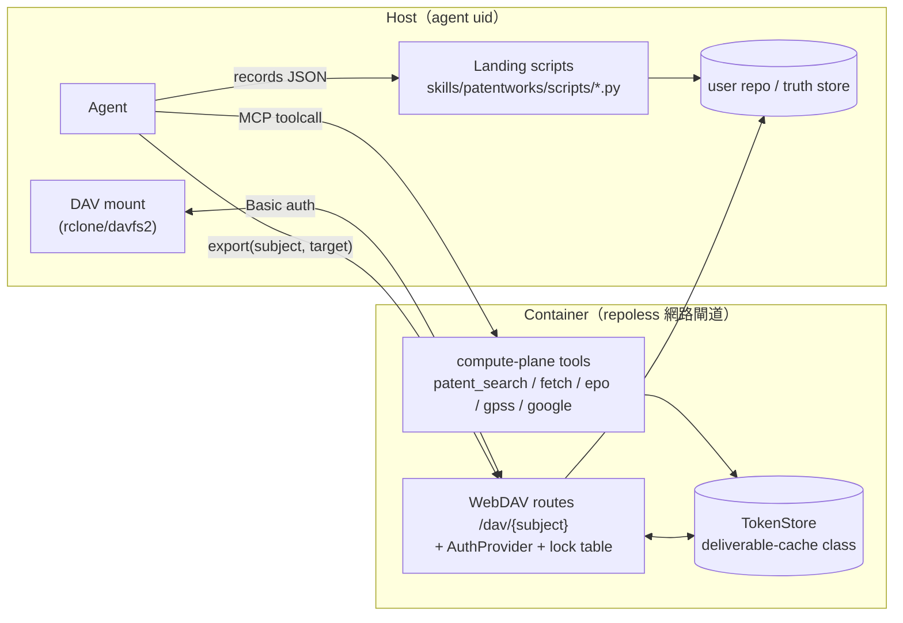

# Design: patentmcp_webdav-r13-refactor

## Context

patentmcp 已通過 mcp-integration-standard 基本面（`specs/patentmcp/mcp-standard-conformance/`，living）。本 plan 落地標準的兩個後續層次：**R13 compute/landing split**（specbase reference impl）與 **WebDAV working cache**（docxmcp `specs/mcp/webdav-working-cache/` 已驗證 pattern）。使用者拍板：WebDAV 做完整 docxmcp 版；R13 積極拆；容許 breaking change（typed redirect）。

盤點依據：`.tmp/inventory-r13-webdav.md`（2026-07-03，26 tools 全清單 + token store + 插入點）。

## 架構總覽

## Goals / Non-Goals

**Goals**

- WebDAV working cache（完整 docxmcp 版）：provision/export/close 生命週期、per-owner credential、dirty gate、class-2 DAV、class-aware reaper。
- R13 積極拆：確定性後處理落地為 skill scripts；container 收斂為 repoless 網路閘道。
- 下架 tool 走 typed `TOOL_LANDED` redirect；mcp.json R13.5 兩平面宣告。

**Non-Goals**

- 不動 gateway C code；不改已完成的 R1/R7/R8 conformance 面；不改 search 來源梯邏輯；不做 persistent 個人空間；不改 anonymous token TTL/LRU 語意。

## 兩平面切分（R13）

### Compute plane（container 保留 — 網路/憑證）

`patent_search`、`epo_family`/`epo_biblio`、`gpatents_get`/`gpatents_download_pdf`/`gpatents_download_figure`、`gpss_download_*`、`fetch_patent_pdf`、`uspto_patents`、`google_get_*`/`google_budget_status`、`patent_get_claim1`、`ppubs_batch_get_claims`、`patentmcp_batch_download_figures`、新增 `pool_fetch`（analyze_pool 的取數半段，回 records JSON handle）。

### Landing plane（skills/patentworks/scripts/，python3，R13.2/R13.3/R13.6）

| Script | 落地內容 | 來源 |
|---|---|---|
| `screening_build.py` | records JSON → family dedup → column select → CSV | screening_table.py:57-356（純轉換） |
| `claims_tools.py` | clean_html_text / extract_claim1_text / claim1_empty | patents.py:1146-1178 |
| `search_audit.py` | matrix-log.jsonl rigor gate（原本就零網路） | patents.py:3268-3307 |
| `figure_extract.py` | PDF → FIG.1 定位 → PNG（poppler CLI，host 需 poppler，precheck fail-fast） | patents.py:1536-1844 |
| `pool_charts.py` | records JSON → 6 matplotlib 圖 | patents.py:3110+ |
| `patentdb_local.py` | put / query / import_csv over 本地 sqlite | patentdb_store.py |
| `_lib/`（共用模組） | adapters + 純轉換函式 vendored copy | src/patent_mcp_server/_pure/ 抽出 |

### 下架（typed `TOOL_LANDED` redirect stub，一版本後移除）

`build_screening_table`、`stage_file`（被 DAV PUT 取代）、`search_audit`、`patentdb_put`/`patentdb_query`/`patentdb_import_csv`、`extract_representative_figure`（fetch 半段由 `fetch_patent_pdf` 承接）、`patentmcp_analyze_pool`（取數半段 → `pool_fetch`，圖表 → `pool_charts.py`）。

## Decisions

- **DD-1 landing 執行器 = python3 stdlib-first**：scripts 以 `python3 <skill>/scripts/<verb>.py --repo <abs> [--in records.json ...]` 呼叫。`screening_build`/`claims_tools`/`search_audit`/`patentdb_local` 限 stdlib；`figure_extract` 依賴 poppler CLI、`pool_charts` 依賴 matplotlib —— 皆 precheck，缺依賴 typed fail-fast（`MISSING_DEPENDENCY`），不靜默降級。
- **DD-2 純轉換單一 SSOT，雙邊 vendored**：把 `screening_table.py` 的純函式抽為 `src/patent_mcp_server/_pure/`（無第三方依賴），container 內 import 原件；landing scripts 帶 vendored copy（R13.6 self-contained），CI test 比對兩份 hash，drift fail-fast。
- **DD-3 TOOL_LANDED typed redirect**（specbase pattern，使用者拍板）：下架 tool 保留 stub，回 `{success:false, error_code:"TOOL_LANDED", landing:{script, usage}}`，不執行舊邏輯；`0.5.0` 移除 stub。
- **DD-4 WebDAV = docxmcp 完整版，落在 patentmcp 端 Starlette**：`/dav/{subject}/…` class-2 method 表（OPTIONS/PROPFIND/GET/PUT/DELETE/MKCOL/MOVE/LOCK/UNLOCK）+ multistatus composer + in-memory lock table（TTL；重啟丟 lock = WebDAV 標準行為）。掛在 `_http_app.py build_app()` 既有 extras 旁（:312-322）；**不得攜帶自己的 lifespan**（單一 FastMCP session-manager lifespan 約束，_http_app.py:338-345）。
- **DD-5 cache = deliverable-cache class（docxmcp DD-4 語意）**：TokenStore entry 增 `class: deliverable-cache | ephemeral`、`subject_id`、`owner_identity`、`last_export_at`、credential hash。reaper class-aware：ephemeral 維持 3600s idle；deliverable-cache dirty 不 reap + safety-net 長 TTL warn-first。舊 anonymous token 語意不變。
- **DD-6 身分 = per-owner credential（Basic），provision 走 MCP tool**：DAV 面（含已發布的 TCP :8000）**一律要求 Basic auth**。`cache_provision(subject)` MCP tool 發 per-owner 高熵 credential（存 hash，constant-time 比對）；`cache_list`/`cache_export`/`cache_close` 同為 MCP tools。owner_identity 取自 provision 呼叫端宣告 + per-user compose 天然隔離；跨 owner DAV 存取 typed 403，無 identity fallback（天條 §11）。不做 gateway JWT 自驗（不引入 docxmcp DD-10 的 R8 secret 共享風險；patentmcp 無瀏覽器面需求）。
- **DD-7 export/close 語意照搬 docxmcp DD-5/DD-6**：`export(subject, target)` 顯式落地（COPY 不 MOVE，N:M target，不可達 typed `EXPORT_TARGET_UNREACHABLE` 502）；`close` dirty gate（mtime/hash vs 上次 export 快照，dirty → `WORKSPACE_CLOSE_DIRTY` 409 + 清單，`force` 逃生）。
- **DD-8 no-silent-fallback 全線**：auth 失敗 401（帶 WWW-Authenticate）/ 越界 403 / traversal typed 拒絕 / lock 衝突 423 / target 不可達 502 / dirty close 409。
- **DD-9 mcp.json R13.5 宣告**：instructions 列兩平面 verb 清單 + landing script 呼叫形式；version 0.3.0 → 0.4.0（breaking：tool 下架）。

## Risks / Trade-offs

- **R1 host 依賴（poppler/matplotlib）** — mitigation：precheck fail-fast；skill 文件宣告依賴；核心建表路徑 stdlib-only。
- **R2 vendored `_pure` 漂移** — mitigation：hash 同步 test，drift fail-fast。
- **R3 TCP :8000 上的 DAV 未認證風險** — mitigation：DAV 面強制 Basic auth，不因 UDS 信任而豁免。
- **R4 lock table in-memory 重啟丟失** — mitigation：WebDAV 標準行為，client 重取；lock 帶 TTL。
- **R5 patentdb inline absorb 消失** — mitigation：`patentdb_local.py import` 承接；工作流寫入 skill。

## Critical Files

- `src/patent_mcp_server/_http_app.py` — DAV route 群 + multistatus + lock table 掛載點（:312-322）
- `src/patent_mcp_server/_token_store.py` — deliverable-cache class + dirty/export 追蹤 + mkdir/move helper
- `src/patent_mcp_server/_auth_provider.py`（新）— credential 發放/驗證 + owns()
- `src/patent_mcp_server/_dav.py`（新）— DAV method handlers
- `src/patent_mcp_server/_pure/`（新）— 抽出的純轉換 SSOT
- `src/patent_mcp_server/patents.py` — tool 下架 stub + `pool_fetch` + `cache_*` tools
- `skills/patentworks/scripts/`（新）— 6 landing scripts + vendored `_lib/`
- `mcp.json` — version 0.4.0 + 兩平面 instructions
- `skills/patentworks/SKILL.md` + `flows/screening.md` — 工作流改寫（本地建表、DAV 心智）

## Validation Plan

- 單元：`_pure` 函式既有 tests 全綠；DAV method 表 per-method tests；auth 401/403/423；dirty close 409。
- 等價：同一 records JSON 經 `screening_build.py` 與舊邏輯產出 byte-equal CSV（golden test）。
- 實掛：rclone 對 DAV 端點 copyto/lsf/cat/mkdir/moveto/deletefile 全過。
- 回歸：既有 `/files/{token}` CRUD + TTL/LRU 測試不變；`webctl.sh refresh` 後 UDS /health + /tools 正常。
