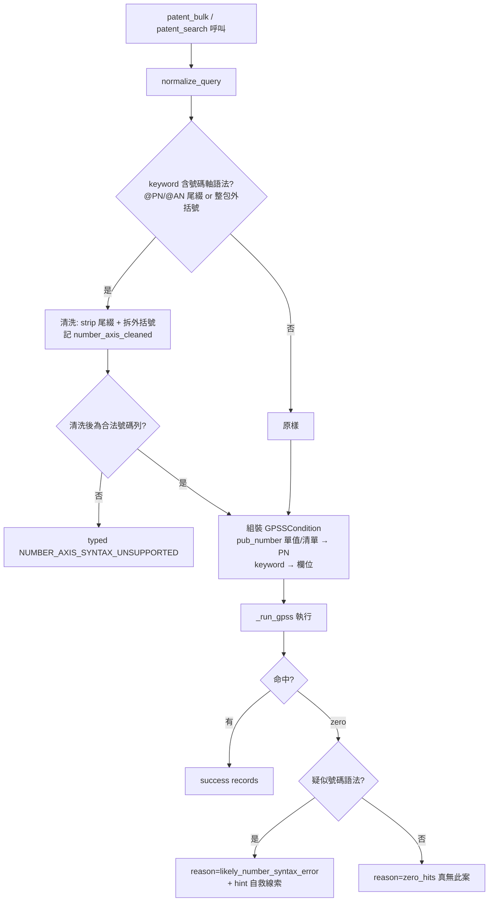

# Proposal: patentmcp_patent-bulk-number-axis-fail-loud

_語言：[zh-hant](./) · **en**_

> Auto-generated index for the `patent-bulk-number-axis-fail-loud` topic. Edit the source files; this README mirrors them. Do not edit this file directly.

## Status

**Living** · 7 history entries · last advance 2026-07-19 (mode `promote` from verified)

## Source artifacts

- [`proposal.md`](./proposal.md) — why this exists · modified 2026-07-17
- [`design.md`](./design.md) — architecture & decisions · modified 2026-07-17
- [`tasks.md`](./tasks.md) — checklist · 15/15 done (100%) · modified 2026-07-17
- [`idef0.json`](./idef0.json) + _no SVGs yet_ — formal functional decomposition
- [`grafcet.json`](./grafcet.json) + _no SVGs yet_ — formal runtime behavior
- `.state.json` — lifecycle state machine

## Why (excerpt)

- <why this work exists — problem / opportunity / pressure>

[Full →](./proposal.md)

## Architecture overview

[Full design →](./design.md)

## Recent activity

- 2026-07-19: `promote` verified → living — user-confirmed-KB-graduation-batch
- 2026-07-17: `promote` implementing → verified — 10 新測試綠 + 219 全套無回歸 + architecture sync + 容器 restart 重掃
- 2026-07-17: `sync` (initial) → undefined — post-task sync, clean
- 2026-07-17: `promote` planned → implementing — BR_20260718 artifacts 就緒
- 2026-07-17: `promote` designed → planned — BR_20260718 artifacts 就緒

<!-- AUTO-GENERATED by plan-builder MCP plan_sync · 2026-07-19T18:46:31Z · do not edit this file. -->
