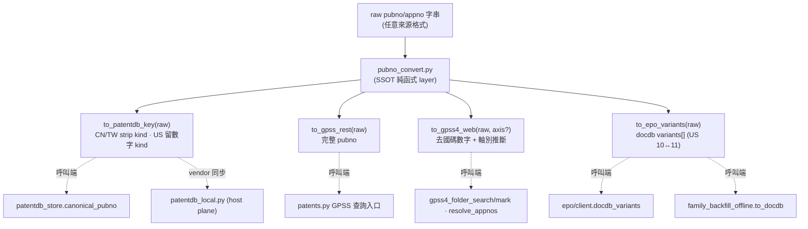

# Proposal: patentmcp_cross-db-pubno-converter

_語言：[zh-hant](./) · **en**_

> Auto-generated index for the `patentmcp_cross-db-pubno-converter` topic. Edit the source files; this README mirrors them. Do not edit this file directly.

## Status

**Living** · 6 history entries · last advance 2026-07-19 (mode `promote` from verified)

## Source artifacts

- [`proposal.md`](./proposal.md) — why this exists · modified 2026-07-19
- [`design.md`](./design.md) — architecture & decisions · modified 2026-07-19
- [`tasks.md`](./tasks.md) — checklist · 16/16 done (100%) · modified 2026-07-19
- [`idef0.json`](./idef0.json) + _no SVGs yet_ — formal functional decomposition
- [`grafcet.json`](./grafcet.json) + _no SVGs yet_ — formal runtime behavior
- `.state.json` — lifecycle state machine

## Why (excerpt)

同一件專利在不同資料源需要**不同的號碼格式**（patentdb PK / GPSS REST / GPSS4 web @PN·@AN / EPO OPS docdb），
但目前沒有單一權威 converter。號碼格式邏輯**散落在至少 5 處**，各查詢點臨場處理，導致兩類系統性損害：

1. **假 miss / 假 not_found 反覆發生**：查詢用了某 DB 不接受的格式 → 回空 → 被誤判「資料真的沒有」。
   （近例：EPO US pre-grant 序號 10↔11 位單形式 404 → 誤判「EPO 對 A1 全 miss」；kind-strip key 對帳騙局
   造成 CN「4,432 pending」大半假缺口。）
2. **消費端被迫盲試格式變體燒 token**：每碰到查不到就派實驗試 3-4 種格式變體 —— 系統性浪費，
   應由 converter layer 一次把 mapping 坐實。

根本問題不是任一模組的 bug，而是**「號碼格式知識沒有 SSOT」這條架構契約從未建立**。每次散點修復
（`docdb_variants`、`normalize_pubno` US 前綴、TW @AN 軸別路由）都只補了一個症狀點，格式邏輯繼續分裂。

[Full →](./proposal.md)

## Architecture overview

[Full design →](./design.md)

## Recent activity

- 2026-07-19: `promote` verified → living — 使用者明確指示畢業提交;3.4 實查 roundtrip 全命中,verified 齊全
- 2026-07-19: `migration` implementing → verified — 3.4 實查 roundtrip 全跑命中,tasks 全 [x],純函式+回歸+實查三層驗證齊全
- 2026-07-19: `promote` planned → implementing — begin burst implementation
- 2026-07-19: `promote` designed → planned — all artifacts filled; ready to implement
- 2026-07-19: `promote` proposed → designed — IDEF0-first design + mapping table + DD-1..5 authored

<!-- AUTO-GENERATED by plan-builder MCP plan_sync · 2026-07-19T15:19:04Z · do not edit this file. -->
