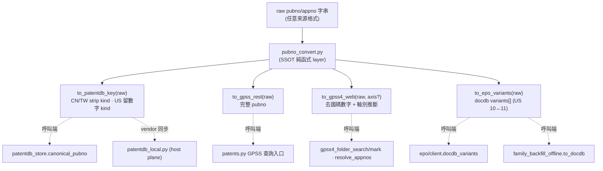

# Design: patentmcp_cross-db-pubno-converter

## Context

同一件專利在不同資料源需要不同號碼格式（patentdb PK / GPSS REST / GPSS4 web @PN·@AN / EPO OPS docdb），
但號碼格式邏輯**散落在至少 5 處**，各查詢點臨場處理。這造成兩類系統性損害：假 miss/假 not_found 反覆發生，
消費端被迫盲試格式變體燒 token。根本問題是「號碼格式知識沒有 SSOT」這條架構契約從未建立——
每次散點修復（`docdb_variants`、`normalize_pubno` US 前綴、TW @AN 軸別路由）都只補了一個症狀點。
現在把號碼格式知識收斂為單一純函式 converter layer。

## IDEF0 對映（架構掛在骨架上）

架構直接掛在 IDEF0 骨架（idef0.json）上，非事後回填：**A1「正規化解析 raw 號碼」** 產出
`(country, normalized_no, kind)` 三元組（對應 `_get_patent_country_and_normalized_no` 的收斂目標）；
**A2「投影為目標 DB 格式」** 依三元組 + 目標 DB 語義規則產出該 DB 接受形式，歧義時回 variants 陣列。
四個 `to_<db>` 函式都是 **A2** 的具體出口，共用 **A1** 的解析結果——「先解析一次、再多路投影」的單一資料流，
杜絕各查詢點各自重解析號碼。

## Goals / Non-Goals

**Goals**

- `pubno_convert.py` 成為跨 DB 號碼格式唯一真實來源，4 個 `to_<db>` 函式覆蓋 CN/US/TW × pubno/appno。
- 5 處散點退化為 thin caller，刪除本地重複格式邏輯。
- 號碼格式知識從隱性慣例升格為顯式 mapping 知識表（每條附實測依據）。

**Non-Goals**

- 不做號碼合法性 validator（converter 只做格式轉換）。
- 不建 converter 的 MCP 工具介面（純內部 library）。
- 不改 patentdb schema / PK 語義（`canonical_pubno` 向後相容）。

## Decisions

- **DD-1: 落點 = src 正典 + host vendor 同步（使用者確認）。** `src/patent_mcp_server/pubno_convert.py`
  是 canonical SSOT。`skills/patentworks/scripts/patentdb_local.py` 是 host-side landing plane，R13.6 契約
  明文「no import from src/」（host uid 直操 sqlite，不進 container）。因此 converter canonical 邏輯在 src；
  host 側以 **vendor 複製 + 頂部同步註記** 維持一致，不打破 no-import 契約。**拒絕**「repo 根共用 package
  雙方 import」——那打破 R13.6 隔離意圖。同步保障：pytest 加 **vendor-drift guard**，比對 src 與 vendored
  的 `normalize_pubno`/`canonical_pubno` 函式體逐字相同，drift 即 fail。

- **DD-2: variants-first 是顯式 fallback list，非 silent fallback（使用者天條）。** 函式回 `list`（主形式在前），
  查詢端逐個顯式試（caller 可見迴圈）。無法明確解析時回空 list / raise，呼叫端 fail fast，**絕不** silent
  fallback 到猜測號（呼應 §2.4 CN543 錯件圖 silent fallback 血淚）。

- **DD-3: `to_patentdb_key` = 現 `canonical_pubno` 行為向後相容（硬閘）。** 語義完全等同現行 `canonical_pubno`
  （`country + normalize_no`，CN/TW 剝 kind、US 留數字 kind）。輸出對所有既有輸入必須逐字不變，回歸測試把關。
  `canonical_pubno` 改為 `return to_patentdb_key(x)` thin 委派。另提供 `patentdb_key_variants(raw)` →
  `[stripped_key, original_with_kind]`，供對帳端同時查兩 key（§2.4 騙局1：CN 4432 假缺口根因）。

- **DD-4: `to_gpss4_web` 強制/推斷軸別（§2.4 TW 軸別錯位）。** `to_gpss4_web(raw, axis=None)` →
  `(number_str, axis)`；`number` = 去國碼原始數字。顯式 axis 直接用；`axis=None` 從號形推斷：
  `TW\d{9}`（民國年 3+6）= 申請號 → `apply`(@AN)，否則預設 `pub`(@PN)。杜絕「TW 申請號誤走 @PN → 假 miss
  → 掉爬蟲」（`event_20260718_ppubs_tw_quota_bugfixes` Bug 2）。

- **DD-5: `to_epo_variants` 收編 BR 臨時補丁 docdb_variants（升格）。** BR §6 的 `epo/client.py::docdb_variants`
  （US pre-grant 10↔11 位雙變體）升格為 converter 的 `to_epo_variants(raw)`。`epo/client.py` 的
  `to_docdb`/`docdb_variants` 改為 thin re-export（保留既有 import 路徑）。`family_backfill_offline.py` 的
  **簡化版 `to_docdb`**（無 US 變體，散點退化）改呼叫 converter，取回完整變體能力。

## Mapping 知識表（每條附實測依據；converter docstring 亦同步）

| 維度 | 目標函式 | 輸出形式 | 實測依據 |
|---|---|---|---|
| CN pubno `CN119230141A` | `to_patentdb_key` | `CN119230141`（剝 kind） | patentdb 現 key 慣例；§2.4 騙局1 |
| CN pubno 對帳 | `patentdb_key_variants` | `["CN119230141","CN119230141A"]` | §2.4 騙局1：CN 4432 假缺口 |
| US grant `US11213256B2` | `to_patentdb_key` | `US11213256B2`（留數字 kind） | `normalize_pubno` 現行；8位序號無變體 |
| US pre-grant `US20230053201A1` | `to_epo_variants` | `["US.20230053201.A1","US.2023053201.A1"]` | §2.3+騙局3+`event_20260719_epo-docdb-format-bug` |
| TW appno `TW109112770` | `to_gpss4_web(raw,None)` | `("109112770","apply")` | §2.1 實測 hits=2 → TW202138759A |
| TW appno `TW113141212` | `to_gpss4_web(raw,None)` | `("113141212","apply")` | §2.1 實測 hits=1 → TW202619683A |
| TW appno `TW112107009` | `to_gpss4_web(raw,None)` | `("112107009","apply")` | §2.1 實測 hits=2 → TW202435176A |
| TW pubno 公告 `TW578729U`/`TWM305142U` | `to_patentdb_key` | 剝 kind；`TWM/TWI/TWD` 憑證段保留 | §2.5；gpss4 patno.py TW[IMD] regex |
| 任意 → GPSS REST | `to_gpss_rest` | 完整 pubno（含 kind） | GPSS REST `pub_number` 接受完整 pubno（§2.3） |

> **實測缺口誠實標記**：US pre-grant 10↔11 變體僅對 §2.3 已坐實 pattern 有依據；其他國別 EPO docdb
> 序號變體（若有）未實測，converter docstring 標 `# UNVERIFIED — needs roundtrip`，不憑推測擴充變體規則。

## Risks / Trade-offs

- **canonical_pubno 行為漂移** — mitigation: 回歸測試以既有 patentdb 實 key 抽樣把關；`to_patentdb_key`
  必須對既有輸入逐字等同舊 `canonical_pubno`。
- **vendor 複製再度分裂** — mitigation: DD-1 的 pytest vendor-drift guard 把人工紀律升為機檢閘。
- **實查驗證燒額度/觸發 GPSS4 鎖定** — mitigation: 實查僅抽 §2.1 已坐實案例各一次，挑下班時段，EPO 只查
  §2.3 單一案例。

## Critical Files

- `src/patent_mcp_server/pubno_convert.py` — **新建**，canonical SSOT 純函式 layer。
- `src/patent_mcp_server/epo/client.py:27,45` — `to_docdb`/`docdb_variants` 升格 `to_epo_variants`。
- `src/patent_mcp_server/patentdb_store.py:82,109` — `normalize_pubno`/`canonical_pubno` 委派 converter。
- `src/patent_mcp_server/patents.py:1003,1267` — 第5處重複 country/normalize + TW @AN 軸別推斷。
- `scripts/family_backfill_offline.py:43` — 簡化版 `to_docdb`（退化，無 US 變體）改呼叫 converter。
- `skills/patentworks/scripts/patentdb_local.py:62,89` — vendored `normalize_pubno`/`canonical_pubno` vendor 同步。
