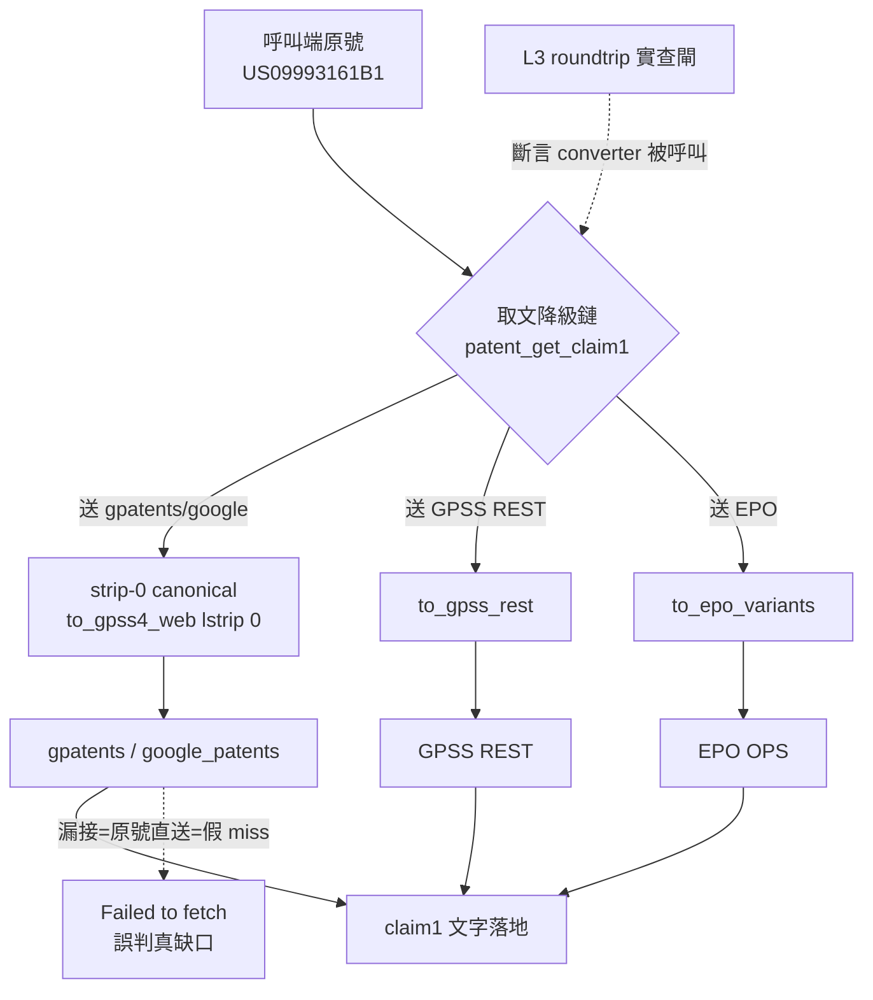

# Proposal: patentmcp_enrich-fetch-converter-wiring

_語言：[zh-hant](./) · **en**_

> Auto-generated index for the `patentmcp_enrich-fetch-converter-wiring` topic. Edit the source files; this README mirrors them. Do not edit this file directly.

## Status

**Living** · 6 history entries · last advance 2026-07-21 (mode `promote` from verified)

## Source artifacts

- [`proposal.md`](./proposal.md) — why this exists · modified 2026-07-20
- [`design.md`](./design.md) — architecture & decisions · modified 2026-07-20
- [`tasks.md`](./tasks.md) — checklist · 9/9 done (100%) · modified 2026-07-21
- [`idef0.json`](./idef0.json) + _no SVGs yet_ — formal functional decomposition
- [`grafcet.json`](./grafcet.json) + _no SVGs yet_ — formal runtime behavior
- `.state.json` — lifecycle state machine

## Why (excerpt)

這是 `BR_20260719`（跨 DB pubno converter layer，已 resolved）的**第三度同族復發**：converter 有能力、docstring 有 mapping（L1/L2 到位），但取文降級鏈這個消費點漏接線（L3 實查閘未覆蓋 → 漏網）。前兩個漏網消費點：US A1 pre-grant 10↔11 位、US grant/old-A strip-0。

[Full →](./proposal.md)

## Architecture overview

[Full design →](./design.md)

## Recent activity

- 2026-07-21: `promote` verified → living — 使用者明確指示畢業:取文降級鏈接 converter + L3 閘,verified 通過
- 2026-07-21: `promote` implementing → verified — 取文降級鏈 5 送查點接 per-target converter + L3 閘擴充落地,pytest 329 pass/0 fail + 新測 37 pass,orchestrator 獨立驗證
- 2026-07-21: `promote` planned → implementing — fast-forward pass-through (burst implementation; all tasks checked + validation evidence): 取文降級鏈 5 送查點接 per-target converter + L3 閘擴充落地,pytest 329 pass/0 fail + 新測 37 pass,orchestrator 獨立驗證
- 2026-07-20: `promote` designed → planned — tasks + handoff filled; ready for implementation
- 2026-07-20: `promote` proposed → designed — core artifacts filled: proposal/spec/design(mermaid+idef0-ref)/idef0/grafcet

<!-- AUTO-GENERATED by plan-builder MCP plan_sync · 2026-07-21T00:04:58Z · do not edit this file. -->
