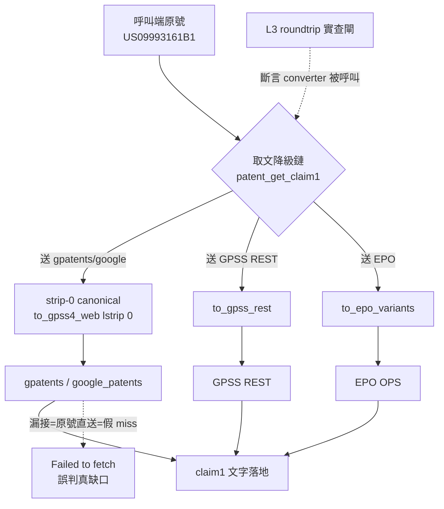

# Design: patentmcp_enrich-fetch-converter-wiring

## Context

`pubno_convert.py` 已是 per-target 分治設計，每個取文源有對應正規化函式（`to_gpss_rest` / `to_gpss4_web` strip-0 / `to_epo_variants` / `to_docdb` / `to_patentdb_key`）。BR_20260719 前輪已收斂 5 處消費端散點，但**取文降級鏈這個消費點漏接**——`patent_get_claim1` / `patent_enrich_backfill` 送外部源前拿原號直送。US grant 前導零號直送 gpatents 必 miss，補撈 subagent 誤診「451 筆真缺口」。

實測坐實因果鏈：`patent_get_claim1("US09993161B1")` → `Failed to fetch`；剝零 `patent_get_claim1("US9993161")` → `success`。號碼形態沒錯，錯在取文端跳過 converter。

## Goals / Non-Goals

**Goals**

- 取文降級鏈每個送查點在呼叫外部源前過該源 per-target converter。
- L3 roundtrip 實查閘擴充覆蓋取文降級鏈，防第四次同族復發。

**Non-Goals**

- 不改 converter mapping 規則（strip-0 / variants 已對）。
- 不新增背景 job / 輪詢（subagent 誤診的 transport 方案，非根因）。

## Architecture

此架構直接 hung on IDEF0 骨架：**A1 識別取文源**（降級鏈選定當前跳）→ **A2 per-target 正規化號碼**（缺的那條 wiring，本 plan 的根治點）→ **A3 送查取文並落地**。現況 A1→A3 之間跳過了 A2，把原號裸送；根治即把 A2 插回每個送查點並用 L3 閘釘死。

## Decisions

- DD-1: 送查前正規化（非 fetch 失敗後補救）。現況 `patents.py:1238` 是「gpatents 失敗→改走 @AN 路由」的事後補救，掩蓋根因。正解是送查**前**過 converter，讓正確號一次命中。
- DD-2: per-target 分治，復用既有 `to_*`。送 gpatents/google → strip-0 canonical（復用 `to_gpss4_web` 的 `lstrip("0")`）；送 GPSS REST → `to_gpss_rest`；送 EPO → `to_epo_variants`。不新造格式邏輯。
- DD-3: L3 閘擴充是防回歸核心。BR 文末已三度應驗「L3 防知道但漏做」；取文端 roundtrip 實查（前導零號跑 `patent_get_claim1` 斷言成功）是唯一能在第四次漏接時當場 fail 的機制。

## Risks / Trade-offs

- 風險：取文降級鏈可能有多個分散送查點，漏改一個即再復發。緩解：grep 全取文送查點清單，逐點接線 + L3 閘覆蓋每點。
- 風險：正規化改動可能影響已能命中的號碼。緩解：converter 對已正確號是 idempotent（`to_gpss4_web("US9993161")` 仍回 `US9993161`），且測試向量含正常號 sanity。

## Critical Files

- `patents.py` — 取文降級鏈送查點（`patent_get_claim1` / `patent_enrich_backfill`，gpatents 送查 :1437/:1440）
- `pubno_convert.py` — per-target converter（唯讀依賴，不改）
- `tests/` — 取文端 roundtrip 實查向量
