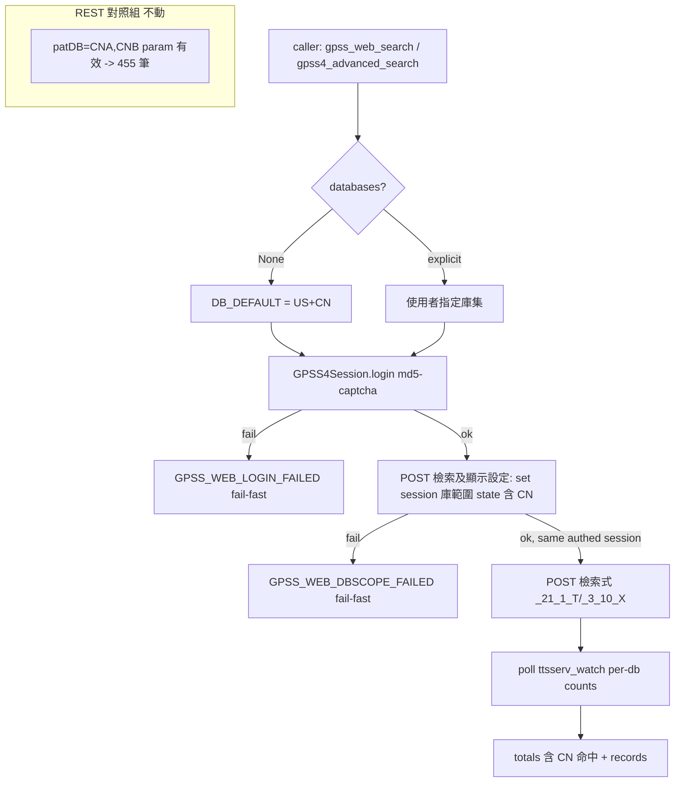

# Proposal: patentmcp_gpss-web-login-db-scope

_語言：[zh-hant](./) · **en**_

> Auto-generated index for the `patentmcp_gpss-web-login-db-scope` topic. Edit the source files; this README mirrors them. Do not edit this file directly.

## Status

**Living** · 6 history entries · last advance 2026-07-16 (mode `promote` from verified)

## Source artifacts

- [`proposal.md`](./proposal.md) — why this exists · modified 2026-07-16
- [`design.md`](./design.md) — architecture & decisions · modified 2026-07-16
- [`tasks.md`](./tasks.md) — checklist · 14/14 done (100%) · modified 2026-07-16
- [`idef0.json`](./idef0.json) + _no SVGs yet_ — formal functional decomposition
- [`grafcet.json`](./grafcet.json) + _no SVGs yet_ — formal runtime behavior
- `.state.json` — lifecycle state machine

## Why (excerpt)

- **BR_20260716**: `gpss_web_search`(gpss3) 與 `gpss4_advanced_search` 兩條零 API 額度的 web 檢索路徑，對大陸公開/公告（CNA/CNB）一律回 0——但同軸檢索式在 REST 端 `patent_bulk(source=gpss, databases=["CNA","CNB"])` 撈到 455 筆 CN 實體書目，人類手動登入 TIPO GPSS 網頁查同式子亦有大量命中。
- **根因（Playwright 鐵證定案）**: gpss 網頁的檢索庫範圍由**登入 session 的預設/設定庫勾選 state** 決定；code 送的 `patDB` POST 欄位在網頁布林檢索表單**根本不存在**（幽靈參數，被伺服器忽略）。code 走的**無密碼匿名 handshake session** 的預設庫集**不含大陸公開/公告** → CN 回 0。
- **契約破裂**: 現行 code 的 DD-2「country via patDB param」是把 REST API 的 `patDB` 語義**錯誤移植**到 web 路徑的未驗證假設。此假設必須被 supersede。
- **價值**: web 路徑的核心價值是「零 API 額度做 CN-heavy landscape 的檢索計數/harvest」；此缺陷使 CN 池在 REST 時段額度耗盡後**無零額度 fallback**，只能枯等額度重置。

[Full →](./proposal.md)

## Architecture overview

[Full design →](./design.md)

## Recent activity

- 2026-07-16: `promote` verified → living — user-confirmed graduation
- 2026-07-16: `promote` implementing → verified — BR_20260716 庫範圍 + 正交 pat_no issue 皆修復並 live 驗證：CN/TW/US 三軸 pat_no 全覆蓋（150/150, 100/100, 100/100），pytest gpss 17 passed，tasks.md 14/14，issue closed
- 2026-07-16: `promote` planned → implementing — user go: task 1 live 逆工 _20_* 設定頁
- 2026-07-16: `promote` designed → planned — tasks+handoff+errors+observability+test-vectors 已就緒
- 2026-07-16: `promote` proposed → designed — RCA 定案(Playwright 鐵證): patDB web 幽靈欄位 supersede DD-2; 修法=登入 session+檢索前設庫範圍 state 含 CN; IDEF0+GRAFCET 已驗證

<!-- AUTO-GENERATED by plan-builder MCP plan_sync · 2026-07-16T17:46:25Z · do not edit this file. -->
