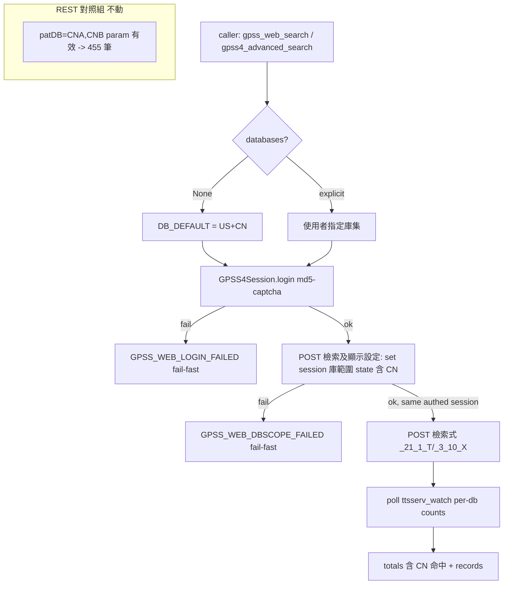

# Design: patentmcp_gpss-web-login-db-scope

## Context

TIPO GPSS 有兩套獨立的檢索通道，庫範圍（patDB）機制**不同**：

- **REST API**（`GPSSClient._build_query`, `gpss/client.py:128-129`）：`patDB=CNA,CNB` 作為 query param **確定有效**，對照組撈 455 筆 CN 為證。
- **Web 路徑**（gpss3 `_gpss_web_search_impl` / gpss4 `adv_search.harvest`）：庫範圍由**登入 session 的庫勾選 state** 決定，網頁檢索表單**沒有 patDB 欄位**。

現行 code 的 DD-2 把 REST 的 `patDB` 語義移植到 web（`patents.py:2982` `data["patDB"]=pat_db`），是**未經人類登入 payload 驗證的錯誤假設**。Playwright 實地取證確認：

1. gpss3 布林檢索 `<form name="KM">` 只有 `INFO / _21_1_T(檢索式) / _0_9_T`，**零 checkbox、無 patDB 欄位**。
2. 匿名「資料範圍」tab 是唯讀庫清單（含中國大陸 CNA/CNB），**零 checkbox**。
3. 登入 member 頁（帶 `GPSS4_USERNAME/PASSWORD`）多出訪客沒有的 **「檢索及顯示設定」** tab——這才是設 session 庫範圍的入口。
4. gpss4 `_submit_query`（`adv_search.py:361`）只送 `_3_10_X=query`，**無任何庫欄位**，查哪些庫全靠登入帳號 session 預設。

因此 code 走的**匿名 handshake session** 預設庫集不含大陸庫 → CN 一律回 0，且 `patDB` 補救無效。

## Goals / Non-Goals

**Goals**

- web 路徑對 CN（CNA/CNB）取得與 REST `databases=["CNA","CNB"]` 一致的覆蓋。
- web 路徑改走登入 session，檢索前設 session 庫範圍 state 納入 CN（及使用者指定 databases）。
- supersede DD-2（`patDB` for web），改用網頁真實庫範圍設定機制。
- `databases` 在 web 路徑雙向生效（納入 + 限縮），連帶治理 `patdb_country_narrowing`。

**Non-Goals**

- 不改 REST 端 patDB 邏輯（REST 有效）。
- 不新增 silent fallback：登入/設庫失敗一律 fail-fast，不靜默降級匿名或 REST（使用者天條）。
- 不處理 totals 主計數行解析（`totals_missing_main_count_line` 另案）。

## Decisions

- **DD-1: web 路徑改走登入 session（GPSS4 member），廢棄匿名 handshake 作為 CN-capable 主路徑。** 匿名 session 預設庫集不含 CN 且無選庫能力（Playwright 鐵證）；只有登入 member 頁有「檢索及顯示設定」選庫入口。複用既有 `GPSS4Session`（`gpss4/session.py`，已解 md5-captcha），不重造登入。gpss3 `_gpss_web_search_impl` 若無法在 gpss4 登入態下複用，則統一收斂到 gpss4 檢索通道。
- **DD-2 [SUPERSEDED by DD-3]: ~~country via patDB POST param (web)~~** — 原假設 web 檢索表單吃 `patDB`；Playwright 證實網頁表單無此欄位，`data["patDB"]` 被伺服器忽略。此假設作廢。
- **DD-3: web 庫範圍是「帳號層級 per-user server-side config」，非 query 參數——修法補「切設定頁→勾庫→存檔→跳回」環節。** （對齊 agent BR `BR_20260716_gpss4_adv_search_missing_peruser_database_scope_config`，該 BR 撤回了「web 對 CN 有 bug」的誤判，正確定位真因。）GPSS4 進階檢索 query 語法層**無國別/庫別限定碼**（合法僅 `@TI/@AB/@CL`、`CS=`、`AD=`；`PD=CN` 非法回 0）。庫範圍是帳號在「進階檢索設定 / 環境設定頁」（`_20_*` slot-key anchor，`adv_search.py:18-21/275-276` docstring 已記其存在、現行流程故意繞開）勾庫存檔後的 per-user state。修法：在既有 authed `GPSS4Session` 上補 `set_search_databases(session, dbs)`——GET `_20_*` 設定頁 → 勾指定庫 checkbox → 存檔 POST → 驗證跳回。

**[task 1 live 逆工定案 2026-07-16]** 真實接縫（`t1_analysis.json`，119 checkbox）：
- **設定頁入口** = member 頁/adv 頁的「喜好設定」slot-key anchor → `_20_*` 環境頁（40KB）。slot-URL 短命，須從當前頁 extract。
- **庫別 checkbox 欄位名** = `_20_1_S_<國別碼>`（value 空、靠 name 出現與否）：大陸公開=`_20_1_S_CA`、大陸公告=`_20_1_S_CB`、大陸設計=`_20_1_S_CD`；台 `TA/TB/TD`、日 `JA/JB/JD`、韓 `KA/KB/KD`、美 `UA/UB/UD`、WIPO `WA`、歐 `EA/EB/ED`、東南亞 `SA/SB`、其他 `OA/OB`。**當前帳號已勾 `CA+CB`**（證實 BR 症狀根因）。**BR 假設的 `CNA/CNB` 代碼錯誤**，真實為 `_20_1_S_CA/CB`（`CNA_CNB_present:false, 大陸_present:true`）。
- **存檔 POST 契約** = form action `/gpss4/gpsskmc/gpsskm?@@<n>`（與 adv query POST 同 `@@` idiom）；hidden = `INFO` + 各 term group `@_20_1_S`/`@_20_23_S`/… markers。
- **存檔持久性（兩模式皆存在）** = 三個 submit：`_IMG_本次套用，限本次登入有效`（session-scoped）/ `_IMG_儲存個人化設定，永久有效`（帳號持久）/ `_IMG_恢復系統預設環境`。→ 直接影響 DD-6 API（見 DD-7）。
- **DD-6: tool 介面 = `gpss4_advanced_search` 加 `databases: list[str]|None` 參數 + 可選獨立 `gpss4_set_search_scope(databases)`。** `databases=None` → 沿用帳號當前範圍（back-compat，現行行為）；`databases=["CNA","CNB"]` → harvest 前先 `set_search_databases` 鎖範圍再送 query，實現檢索端分國同源池。若設定為帳號持久（非 session-scoped），另開 `gpss4_set_search_scope` 讓使用者一次設定、後續 harvest 沿用（依 task 1 逆工結論決定是否需要）。
- **DD-4: fail-fast, no fallback（使用者天條）。** 登入失敗 → `GPSS_WEB_LOGIN_FAILED`；庫範圍設定失敗 → `GPSS_WEB_DBSCOPE_FAILED`；一律不靜默回匿名 session 或 REST。
- **DD-5: `databases` 參數為 session 庫範圍 state 的唯一真實來源（web）。** `databases=None` → 使用「含 CN 的合理預設全庫集」（DB_DEFAULT=US+CN，`gpss/client.py:66-68`）；顯式指定 → 精確映射到選庫 state（同時修 `patdb_country_narrowing` 的限縮不生效）。
- **DD-7: `set_search_databases` 存檔用「儲存個人化設定，永久有效」（帳號持久）submit，非「本次套用」（session）。**（task 1 逆工揭露兩模式皆存在後的使用者拍板 2026-07-16。）帳號持久 = 一次設定後跨 session 保留，後續 harvest（含使用者手動登入網頁）都沿用，不必每次 harvest 前重設。取得 submit name = `_IMG_儲存個人化設定，永久有效`（image submit，POST 帶 `.x/.y`）。因為持久，DD-6 的獨立 tool `gpss4_set_search_scope(databases)` 確定有價值（一次設定、後續沿用）。

## Risks / Trade-offs

- **登入成本 / session 生命週期**：web 路徑從無密碼 handshake 變成 member 登入（~90min session + md5-captcha）——mitigation: 複用 `GPSS4Session` 既有 login + 過期自動重登（已核准行為 DD-4 of session.py），並在 `_GPSS_POLICY.guard()` 內序列化。
- **設定頁 slot-key 短命**：庫範圍設定 POST 必須在 member 頁 render 後、slot-key 失效前，於同一 session 完成——mitigation: 設庫範圍 + 檢索綁在同一 authed session 的連續 request 鏈，不跨 session。
- **gpss3 vs gpss4 通道分歧**：gpss3 handshake 與 gpss4 member 登入是不同 code path——mitigation: 優先確認 gpss4 登入態能否覆蓋 gpss3 布林檢索需求；若能，收斂到單一登入通道，減少維護面。
- **真實 checkbox 欄位名未離線定案**：設定頁 slot-URL 短命，離線 GET 回空殼——mitigation: implementing 階段在 live authed session 內即時 render 抓欄位，非離線推演（避免再造一個「patDB 幽靈欄位」錯誤）。

## Critical Files

- `src/patent_mcp_server/patents.py` — `_gpss_web_search_impl`（2909-3063，patDB 幽靈欄位分支）、`gpss_web_search`（2909+ wrapper）、`gpss4_advanced_search`（5224+）；庫範圍機制主戰場。
- `src/patent_mcp_server/gpss4/session.py` — `GPSS4Session` 登入 state machine（md5-captcha），web 路徑登入複用來源。
- `src/patent_mcp_server/gpss4/adv_search.py` — `_submit_query`（341-380，只送 `_3_10_X=query` 無庫欄位）、`harvest`（477+）；gpss4 檢索通道。
- `src/patent_mcp_server/gpss/client.py` — `DB_DEFAULT`（66-68，含 CN 的預設庫集）、`_build_query`（REST patDB，**不動**，作對照）。

## Architecture

本設計掛在 IDEF0 骨架（`idef0.json`）上，四個 top-level activity 對應下圖與 GRAFCET 步驟：

- **A1 解析庫範圍需求** — `databases` 參數 → 目標庫集（None → `DB_DEFAULT`=US+CN；顯式 → 使用者指定含 CN）。對應 GRAFCET step 0。
- **A2 登入 GPSS4 member session** — 複用 `GPSS4Session`（md5-captcha）取得 authed session + slot-key。對應 step 1；失敗 → step 6 fail-fast。
- **A3 設定 session 檢索庫範圍 state** — 同一 authed session POST「檢索及顯示設定」選庫表單設含 CN。對應 step 2；失敗 → step 7 fail-fast。
- **A4 送出檢索式並輪詢結果** — 已設庫範圍 session 送檢索式 + poll ttsserv_watch 取含 CN 命中。對應 step 3-5。

