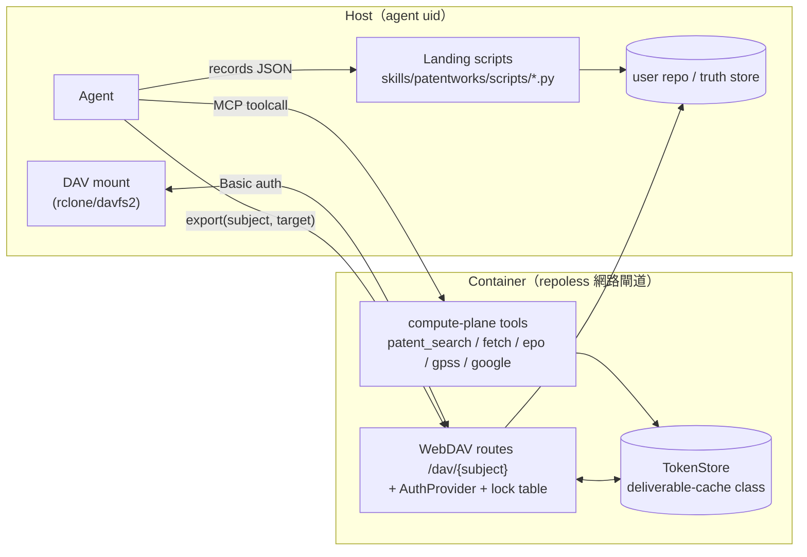

# Proposal: patentmcp_webdav-r13-refactor

_語言：[zh-hant](./) · **en**_

> Auto-generated index for the `patentmcp_webdav-r13-refactor` topic. Edit the source files; this README mirrors them. Do not edit this file directly.

## Status

**Living** · 6 history entries · last advance 2026-07-03 (mode `promote` from verified)

## Source artifacts

- [`proposal.md`](./proposal.md) — why this exists · modified 2026-07-03
- [`design.md`](./design.md) — architecture & decisions · modified 2026-07-03
- [`tasks.md`](./tasks.md) — checklist · 23/23 done (100%) · modified 2026-07-03
- [`idef0.json`](./idef0.json) + _no SVGs yet_ — formal functional decomposition
- [`grafcet.json`](./grafcet.json) + _no SVGs yet_ — formal runtime behavior
- `.state.json` — lifecycle state machine

## Why (excerpt)

- patentmcp 已通過 mcp-integration-standard 基本面（R1/R2/R3/R4/R7/R8，見
  `specs/patentmcp/mcp-standard-conformance/`），但標準此後演進出兩個新層次：
  1. **R13 compute/landing split**（standard.md §R13，specbase 為 reference impl）：
     確定性 repo-local 工作不得躲在 container tool 後面付 token 往返/跨 UID 稅；
     應以 skill-attached local scripts 落地，container 只留真正需要憑證/網路的 compute。
  2. **WebDAV working cache**（docxmcp `specs/mcp/webdav-working-cache/` 已驗證 pattern）：
     token namespace 對 host 暴露成 online 掛載工作區，消滅逐檔 GET/PUT 與 tarball 儀式。
- patentmcp 的 screening 工作流正踩在這兩個缺口上：`build_screening_table` 把純資料
  轉換（去重/切 Claim1/欄位選擇/CSV 組裝）綁進 container；檢索產物（CSV/PDF/figure
  批次）只能逐檔 blob GET 取出。

[Full →](./proposal.md)

## Architecture overview

[Full design →](./design.md)

## Recent activity

- 2026-07-03: `promote` verified → living — 使用者明確指示畢業上線
- 2026-07-03: `promote` implementing → verified — R13 compute/landing split + WebDAV working-cache 全落地; 134 pytest passed; vendor sync 無 drift; docs/architecture 同步; 5.5 rclone 實掛 + 6.4 container UDS 整合驗證延整合階段
- 2026-07-03: `promote` planned → implementing — 開始實作：依 tasks.md 六群交付
- 2026-07-03: `promote` designed → planned — tasks.md 6 群 + handoff.md + test-vectors/errors/observability 完成
- 2026-07-03: `promote` proposed → designed — proposal/design/idef0/grafcet/sequence/data-schema 完成；使用者拍板 WebDAV 完整版+R13 積極拆+breaking 容許

<!-- AUTO-GENERATED by plan-builder MCP plan_sync · 2026-07-03T10:46:51Z · do not edit this file. -->
