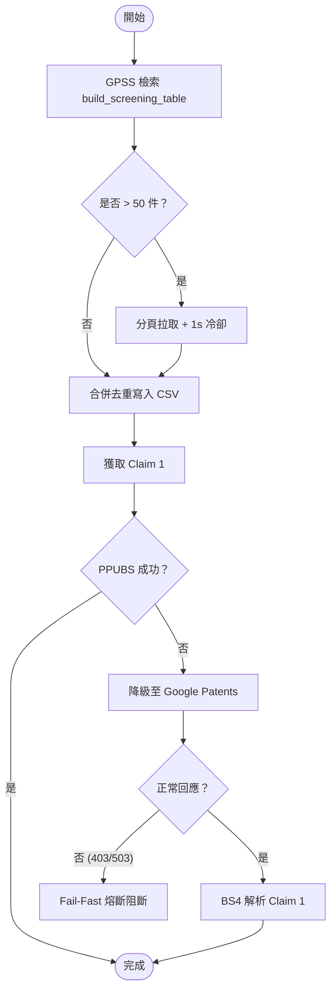

# Proposal: workflow_anomaly_detection_lessons

_語言：[zh-hant](./) · **en**_

> Auto-generated index for the `workflow_anomaly_detection_lessons` topic. Edit the source files; this README mirrors them. Do not edit this file directly.

## Status

**Living** · 6 history entries · last advance 2026-06-27 (mode `promote` from verified)

## Source artifacts

- [`proposal.md`](./proposal.md) — why this exists · modified 2026-06-27
- [`design.md`](./design.md) — architecture & decisions · modified 2026-06-27
- [`tasks.md`](./tasks.md) — checklist · 17/17 done (100%) · modified 2026-06-27
- [`idef0.json`](./idef0.json) + _no SVGs yet_ — formal functional decomposition
- [`grafcet.json`](./grafcet.json) + _no SVGs yet_ — formal runtime behavior
- `.state.json` — lifecycle state machine

## Why (excerpt)

在執行「居家異常偵測與多模態感測技術」專利前案檢索時，暴露出 `patentmcp` 部分 API 與流程的穩定性問題，需要對這些元件進行加固：
1. **GPSS 檢索大池不穩定**：當 `build_screening_table` 檢索結果過大（> 50-100 件）或關鍵字太寬泛時，API 會返回 HTML 或非 JSON 頁面，導致 `'str' object has no attribute 'get'` 崩潰。
2. **US 專利 Claim 1 取得失效**：對 US 專利執行 `patent_get_claim1` 時，常因 PPUBS 無法查詢而報錯，缺乏自動降級至 `gpatents` 抓取與解析的 Fallback 機制。
3. **Google Patents 限流與爬蟲安全性**：批量使用 `gpatents_*` 工具容易遭 Google 限流 (403/503)。工具端需要實現 Fail-fast 阻斷，並在 Schema 與 SOP 中強制將 Google Patents 限制為「單件已知專利下載 fallback 的最後手段」，嚴禁批量爬取。
4. **CSV 處理與 Word 報告組裝雷區**：使用 Shell 腳本處理多行 CSV 易損壞資料；且自製腳本打包 DOCX XML 風險高。需規範本地 CSV 合併僅能使用 Python `csv` 模組，DOCX 報告編譯必須使用 `docxmcp` 的 `assemble` 流程。

[Full →](./proposal.md)

## Architecture overview

[Full design →](./design.md)

## Recent activity

- 2026-06-27: `promote` verified → living — user-confirmed graduation
- 2026-06-27: `promote` implementing → verified — 實作已完成：GPSS 字典安全檢查與分頁、Google Patents Fail-Fast 熔斷、PPUBS 降級路由及 Companion Skill SOP 已部署。3 項單元測試全數通過（OK）。
- 2026-06-27: `promote` planned → implementing — 開始執行實作：著手修改 gpss/client.py, gpatents/client.py, patents.py 以及 Companion Skill 文件以因應異常偵測前案檢索的優化需求。
- 2026-06-27: `promote` designed → planned — 已補齊 handoff.md, test-vectors.json, errors.md, observability.md 等輔助文件，符合 planned 狀態規範。技術規格、測試向量與錯誤處理策略已就緒。
- 2026-06-27: `promote` proposed → designed — 已建立且設計完整 proposal.md, design.md, spec.md, tasks.md 與系統建模圖檔 (IDEF0, GRAFCET, Sequence, Flowchart, Data Schema) 以因應異常偵測前案檢索的優化需求。

<!-- AUTO-GENERATED by plan-builder MCP plan_sync · 2026-06-27T07:08:26Z · do not edit this file. -->
