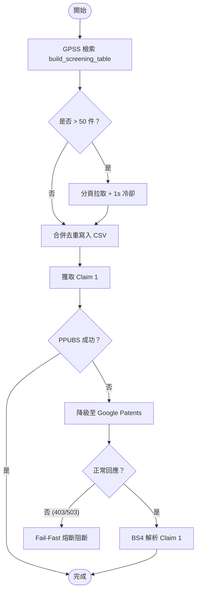

# Design: Anomaly Detection Workflow Lessons Remediation

## Context
在前一階段的異常偵測專利檢索工作中，發現了 API 不穩定與工作流程缺乏備援路徑等缺陷。本設計旨在強化 `patentmcp` 關鍵工具的穩定性，並透過 Companion Skill 文件將安全 SOP 固化，保障後續檢索任務的健全。

## Goals / Non-Goals
- **Goals**:
  - `build_screening_table` 的異常攔截與安全分頁拉取。
  - `patent_get_claim1` 增加降級至 `gpatents` 的 Fallback 機制。
  - `gpatents_*` 遭遇 403/503/429 時的 Fail-fast 熔斷。
  - 合併與固化 SOP 規則至專案 Companion Skill 文件。
- **Non-Goals**:
  - 不引入繞過 Google 驗證的代理人/驗證碼破解服務。
  - 不開發除 `docxmcp` 之外的任何 Word 文件生長腳本。

## Risks / Trade-offs
- **Risk**: 自動分頁拉取會增加 API Latency，在命中數過多時可能導致連接超時。
- **Mitigation**: 分頁僅在檢索結果大於 50 件時觸發，且內部設定適當的冷卻時間（Cooldown）防止被 GPSS 端阻斷。
- **Risk**: Google Patents 網頁結構改變可能導致 `gpatents` 解析 Claim 1 失效。
- **Mitigation**: 僅將 Google Patents 解析作為最後的 Fallback 機制，當其解析失敗時，回退至返回摘要或標記缺失。

## Critical Files
- `vendor/patents-mcp/src/patent_mcp_server/patents.py`: 工具 `build_screening_table`、`patent_get_claim1` 實作。
- `vendor/patents-mcp/src/patent_mcp_server/screening_table.py`: 表格生成與去重邏輯。
- `skills/patent-practitioner-workflow.md`: 專利檢索與報告產出指引。

## Decisions
- **DD-1 (Fail-Fast 熔斷)**: `gpatents` 遭遇 403/503/429 錯誤時，禁止執行緒進行本地 `sleep` 或迴圈重試，必須立即回傳 Fail-Fast 錯誤以防被進一步封鎖。
- **DD-2 (PPUBS-First 降級)**: `patent_get_claim1` 必須以 PPUBS 為優先路由。僅當 PPUBS 響應 `not found` 或失敗時，才降級至 Google Patents 提取頁面並用 BeautifulSoup 抽取 Claim 1。
- **DD-3 (No-Shell CSV 合併)**: 在 Companion Skill 中規範，對於多個 CSV 的合併與去重，禁止使用 `awk`/`sed`，必須使用 Python 的 `csv.DictReader` 與 `csv.DictWriter` 執行。

## Architecture

